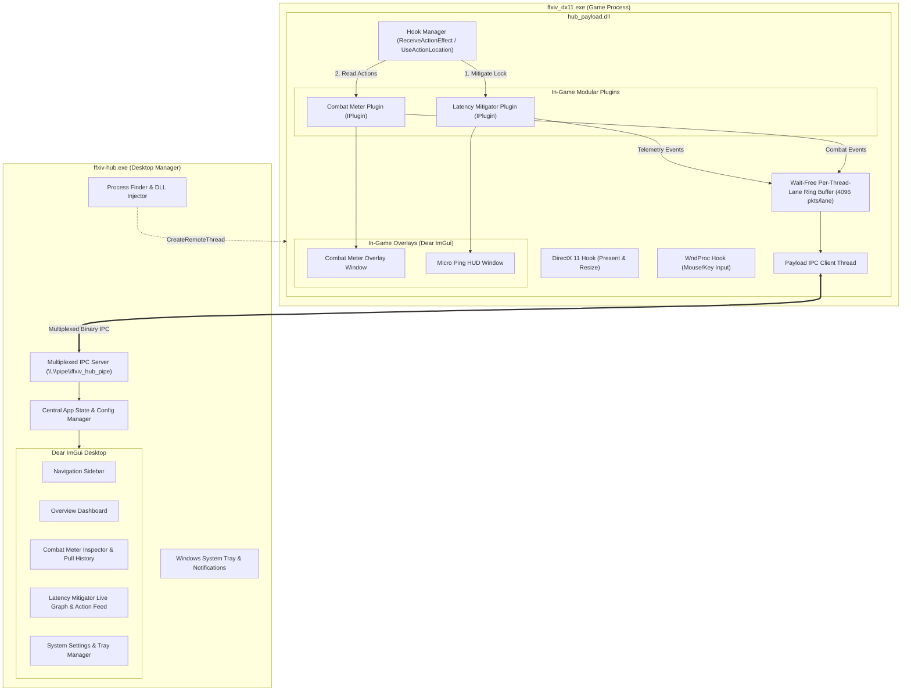

# Agent Guidelines & Architecture Reference: FFXIV Hub

This document defines the architectural patterns, engineering principles, and invariants
for autonomous AI agents and developers working on `ffxiv-hub`.

Plugin-local rules live next to their plugin:
[`plugins/latency_mitigator/AGENTS.md`](plugins/latency_mitigator/AGENTS.md) and
[`plugins/combat_meter/AGENTS.md`](plugins/combat_meter/AGENTS.md). Read those before
touching either plugin's analytics or timing math.

Occasional procedures are skills under `.claude/skills/`, loaded when their trigger
matches: `after-game-patch` (regenerating tables, repairing signatures),
`inspect-game-client` (verifying a client-behaviour premise against the local
`ffxiv_dx11.exe` and SqPack data), `tsan-check` (ThreadSanitizer run after touching meter
threading), `release-windows` (MSVC build, packaging, CI).

---

## 🏛️ Engineering Principles & Guidelines

1. **Strict Separation of Concerns (No God Files & Zero Duplication)**:
   - Every file must have a single, clearly defined responsibility.
   - Common infrastructure (memory scanning, PE section scanning, game signatures, IPC protocol multiplexing, JSON config, OS integration) lives strictly in `src/common/` (`hub::common`).
   - Distinct features are partitioned into modular plugins (`plugins/combat_meter/` and `plugins/latency_mitigator/`) implementing standard C++ interfaces (`IPlugin`, `IOverlay`, `IConfigurable`, `IHookConsumer`).
   - In-game hooking and DirectX 11 presentation reside in `src/payload/`.
   - The desktop GUI dashboard lives in `src/app/`.

2. **Clean Interfaces & 100% Platform-Independent Core**:
   - The algorithmic cores of all plugins (combat analytics, sequence tracking, RTT filters, animation lock formulas), along with the IPC protocol, config parser, and plugin interfaces, must remain **100% platform-independent C++20**, free of `<windows.h>` and DirectX headers.
   - OS-specific subsystems (`logger`, `single_instance`, `auto_start`, `process_finder`, `injector`, `tray_manager`) provide seamless `#ifdef _WIN32` cross-platform mock fallbacks.
   - This ensures the entire core analytics, timing math, and comprehensive unit test suite can be compiled and verified natively on macOS and Linux using `clang++` (`make test`) without emulator overhead.

3. **Memory Safety & Modern C++ Standards**:
   - Standard: C++20 (`-std=c++20` / `/std:c++20`).
   - Use RAII for all resource lifecycles (handles, synchronization primitives, pipes, DirectX COM interfaces).
   - Use `std::span` and typed binary structs for packet parsing rather than raw unbounded pointer arithmetic.
   - Enforce exact binary packing using `#pragma pack(push, 1)` and compile-time `static_assert(sizeof(...) == N)`.

4. **Zero-Dependency Runtime Constraint for Production Windows Binaries**:
   - The project builds a standalone desktop manager (`ffxiv-hub.exe`, built with `/SUBSYSTEM:WINDOWS`) and a single unified in-game payload DLL (`hub_payload.dll`) placed in the same directory, running on Windows 10/11 without requiring:
     - External plugin injectors (Dalamud, XIVLauncher).
     - External web servers or Node/Python runtimes.
     - Kernel filter drivers (WinDivert).
     - Microsoft Visual C++ Redistributable packages (statically linked `/MT` runtime).

5. **Unified Single-Hook Payload Lifecycle**:
   - Rather than injecting multiple independent DLLs into `ffxiv_dx11.exe`, `ffxiv-hub` injects **one single payload** (`hub_payload.dll`).
   - Exactly **one DirectX 11 hook** (`IDXGISwapChain::Present`, `ResizeBuffers`).
   - Exactly **one `WndProc` hook** for transparent mouse/keyboard input management.
   - Exactly **one multiplexed Named Pipe connection** (`\\.\pipe\ffxiv_hub_pipe`).
   - Exactly **one detour for `ReceiveActionEffect`**, dispatching sequentially and deterministically to every registered hook consumer in registration order.

6. **Mandatory Documentation Synchronization**:
   - Whenever code is modified, the author or agent **must verify and update** the docs the change touches:
     - Architecture, components or headers → [`README.md`](README.md) and this file.
     - A plugin's behaviour, analytics or timing math → that plugin's `AGENTS.md` **and** its `README.md`.
     - Binary packet structures or sizes → the IPC invariants below.
     - Critical invariants, timing thresholds, or anti-cheat guardrails → wherever that invariant lives.
     - Build, packaging or CI commands → `.claude/skills/release-windows/`.
     - Generators, signatures or game offsets → `.claude/skills/after-game-patch/`.
     - Binary inspection tooling (`tools/inspect_exe.py`, `tools/xivbin/`) → `.claude/skills/inspect-game-client/`.
     - A user-visible setting or config key → the README that documents that key. Every key is documented in exactly one file.
     - Anything a README screenshot shows → re-render with `make screenshots` and commit `docs/images/`. The tool itself (`tools/screenshots/`) → the README's *Building from source*.
   - **Never leave documentation out of sync with code.** There are now seven documentation files and they must co-evolve with every pull request and agent task.

---

## 📂 Component Responsibility Matrix

### Runtime topology



### Directories

Directory-level. Individual files are discoverable by search; what is recorded here is the
responsibility boundary and the constraint that goes with it.

| Area | Responsibility | Constraint |
|---|---|---|
| `include/hub/` | Public surface: common enums and geometry (`types.hpp`), the plugin interfaces `IPlugin`/`IOverlay`/`IConfigurable`/`IHookConsumer` and `PluginRegistry` (`plugin_api.hpp`), the centralized Dawntrail 7.x AOB signatures, offsets and packet layouts (`game_definitions.hpp`), and game data in `game/` | Platform-independent. `game/` is generated by `tools/gen_game_tables.py`, except the hand-curated `pets.hpp`, `entity.hpp` and `raid_buffs.hpp` |
| `src/common/` | Shared infrastructure: sigscan and PE section scanning, multiplexed binary IPC (protocol, wait-free multi-producer ring buffer with one SPSC lane per producer thread, pipe client and server), zero-dependency JSON and config persistence, and OS integration (logger, process finder, injector, single-instance guard, auto-start, tray, network monitor, process exit, and the RAII `UniqueHandle` in `unique_handle.hpp`) | `src/common/os/` is the only `#ifdef _WIN32` area, and every subsystem there has a mock fallback. An OS handle is owned by a `UniqueHandle`, never closed by hand on each exit path |
| `src/common/ui/` | UI pieces shared by desktop and in-game: the embedded Lucide glyph subset (`icons_font.inl`, generated by `tools/embed_icon_font.py` - do not hand-edit), overlay config and hide conditions, and `job_style.*` | `job_style.*` is the **single source of truth** for a combatant row's job color and Job column label, including the Limit Break and unknown-job cases |
| `src/payload/` | Injected DLL: MinHook lifecycle hooking `ReceiveActionEffect`, `UseActionLocation` and `ProcessHotDot`; the DX11 `Present`/`ResizeBuffers` and `WndProc` detours; the ImGui overlay host; and SEH-protected readers for game objects (names, HP, status lists), game state and commands | Windows-only. All game pointer dereferences are SEH-guarded |
| `src/app/` | Desktop manager: application state machine, game supervisor (its transitions are the pure `decide_connection()` in `connection_state.hpp`, unit-tested on every platform), plugin config store, telemetry router, and the `wWinMain` entry point | - |
| `src/app/ui/` | Desktop views, theme and widget kit, the window frame (`app_frame.*`: fonts, theme, sidebar and current view), plus `plugin_page.*` | `plugin_page.*` is the **mandatory** frame for every plugin view; a plugin needing a different layout needs a change to the scaffold, not a private layout. `app_frame.*` draws the whole window for both `wWinMain` and `tools/screenshots`, so `main.cpp` keeps only the Win32 and DX11 plumbing around it |
| `plugins/latency_mitigator/` | RTT tracking (EMA + median spike filter), sequence matching, cast tracking, animation lock mitigation, and the in-game ping HUD | Algorithmic core is platform-independent. See its [`AGENTS.md`](plugins/latency_mitigator/AGENTS.md) |
| `plugins/combat_meter/` | Action decoding, combatant registry and pet attribution, metrics accumulation and the desktop's per-second timeline, encounter state machine, and the in-game combat table | Algorithmic core is platform-independent. See its [`AGENTS.md`](plugins/combat_meter/AGENTS.md) |
| `src/third_party/` | Vendored MinHook (detours) and Dear ImGui (UI, with Win32/DX11 backends) | Do not modify; warnings from these are silenced, not fixed |
| `tests/` | Header-only cross-platform test runner, runnable on macOS, Linux and Windows | Must stay runnable without Windows |

---

## 🔒 Critical Invariants & Edge Cases

When modifying detours, hooks, or timing/analytics math, the following invariants **must**
be preserved. Plugin-specific invariants live in the two plugin `AGENTS.md` files.

### 1. Single `ReceiveActionEffect` Hook & Deterministic Interception Order
- `ReceiveActionEffect` in `ffxiv_dx11.exe` is intercepted by **one single MinHook detour** in `hook_manager.cpp`, which fans out to every registered `IHookConsumer`.

**Phase ordering is load-bearing.** Inside the detour, in this order:
  1. `on_pre_receive_action_effect` for every consumer, **before** the original runs.
  2. The original engine function, which writes the server's animation lock.
  3. `on_receive_action_effect` for every consumer, **after** the original.

  The mitigator detects whether an action was its own by diffing its pre-snapshot against the value the original wrote (`lock_changed` in `latency_plugin.cpp`). Collapsing or reordering these phases silently breaks mitigation.

**Consumer ordering is a convention, not a data dependency.** `dllmain.cpp` registers the mitigator before the meter, and registration order is dispatch order. The two share no mutable state - the meter never touches `ActionManager` - so the order is kept for determinism and because the mitigator's write-back is racing the client's next frame, not because swapping them would produce a wrong result. Do not rely on it for correctness in a new plugin.

- Never alter packet contents in any consumer.

### 2. Meter Rules That Outside Code Can Break
These live here rather than in the meter's own file because the payload, the app and the
DX11 `Present` path can violate them from outside `plugins/combat_meter/`.

- **`EncounterEngine` Is Shared State, Not Thread-Local**: In-game, three threads reach one engine - the `ReceiveActionEffect`/`ProcessHotDot` detours on the game's main thread, the payload orchestration thread (`sync_party`, `set_zone`, `update`, the vitals pass that reads HP and status lists, and every command from the app), and the DX11 `Present` thread rendering `CombatOverlay`. Every public entry point takes `EncounterEngine::m_mutex` (recursive, because the lifecycle calls re-enter each other). The registry must be reached through `with_registry()`; the raw `registry()`/`accumulator()` accessors do not lock and are for single-threaded use only.
- **Derived Rates Are Recomputed On The Tick, Not Per Packet**: `record_action` only accumulates. `MetricsAccumulator::recalculate` - which walks every combatant, resolves owners and merges pets - runs from `update()`, from `end_encounter()`, and lazily from `current_summary()` when packets have landed since. It must never be called per decoded effect: at raid AoE rates that is an O(combatants) sweep per hit on the game's detour thread.
- **Pulls End On The Client's Combat Alone**: `EncounterEngine::set_game_state` must be fed `GameStateProvider::client_flags()`: in-game by `CombatPlugin::update`, and in the app from `GameStatePayload::client_flags`, which `dllmain.cpp` fills. `flags()`, and `GameStatePayload::flags` with it, fold the meter's own pull into `InCombat` for the overlays. Fed that word, a pull would hold itself open and never end. The payload pushes the game state on any change to either word and at least once a second, because the app's engine takes a report older than `kGameStateTtl` as unknown.

### 3. IPC & Ring Buffer Safety
- **Multiplexed Packet Framing**: Every packet sent over Named Pipe `\\.\pipe\ffxiv_hub_pipe` begins with the fixed 20-byte `PacketHeader`:
  `magic (0x46465848 "FFXH") | version (uint16_t) | plugin_id (uint16_t) | message_type (uint16_t) | reserved (uint16_t) | sequence (uint32_t) | payload_size (uint32_t)`.
- **One Framed Reader**: Both pipes read through `read_frame()` in `src/common/ipc/frame_reader.hpp`, which works over a `read_some(ptr, len)` callback (bytes read, 0 for closed, negative for failure). `PipeClient::read_some` and the `PipeServer` worker's lambda supply only the overlapped `ReadFile` and the stop-event wait; the framing rules below live in the helper once and are tested on Linux (`IPC.FrameReader*`).
- **Validate `payload_size` Before Allocating**: `payload_size` is wire data. Both pipe read loops must reject anything above `MAX_PAYLOAD_SIZE` (64 KB) *before* sizing a buffer from it - a 4 GB `resize` throws `std::bad_alloc` out of a worker thread that has no handler.
- **A Malformed Header Ends The Connection**: The pipes are byte-mode, so a bad magic means the stream is out of frame and cannot be resynchronised. Both sides drop the connection and reconnect rather than skipping bytes. Every framed read loops until it has the full header/payload; a short read is not an error.
- **One Owner Per Pipe HANDLE**: Whoever closes the handle first makes sure no other thread is still inside it: the server's worker detaches it and then waits out any `send_packet` holding `m_send_mutex`; `PipeClient::disconnect()` joins both workers first. `stop()`/`disconnect()` cancel I/O (`CancelIoEx` plus the stop event) but never `CloseHandle` a handle another thread may still be inside - the value gets recycled.
- **Cancel Without The Send Lock**: A write blocked on a peer that is not reading holds `m_send_mutex`, so `stop()`/`disconnect()` must cancel without taking it, or the cancel that would free the writer waits on it. The handle is a `std::atomic<void*>` for that reason; `PipeServer::m_handle_mutex` (never held across I/O) keeps `stop()`'s `CancelIoEx` off a handle the worker already closed. Every overlapped wait, write included, also wakes on the stop event, since a write issued just after the cancel would otherwise block again, and a cancelled operation is waited to completion before its `OVERLAPPED` leaves the stack.
- **One Lane Per Producer Thread**: Outbound packets go through `PacketRingBuffer`, an `MpscRingBuffer` holding one SPSC lane (capacity 4096) per producer thread. A thread claims its lane on its first push. Two payload threads push:
  - the game's main thread, from the `ReceiveActionEffect`/`ProcessHotDot` consumers: both plugins, and `ObjectReader::publish_actor` through the meter's actor resolvers;
  - the orchestration thread: heartbeat, status, game state, overlay geometry, `ObjectReader::sync_party`, and the meter's status lists, life events and enemy HP from `CombatPlugin::on_vitals`.

  The DX11 `Present` thread and the `PipeClient` reader thread push nothing. `PipeClient`'s writer thread is the only consumer and streams packets over the Named Pipe.
  - **The push is wait-free.** It scans at most four lane owners, then does an SPSC push, and never waits on a mutex. `pop()` moves the packet out of its slot rather than copying it.
  - **Producers move their packet in.** `push(std::move(bytes))` is `noexcept` and allocates nothing. The copying `push(const T&)` allocates, so it is not `noexcept` - a `bad_alloc` there would otherwise terminate the game - and it has no place on the detour thread.
  - **Order is FIFO per producer only.** The writer drains lanes round-robin, so nothing may depend on the relative order of packets pushed from different threads.
  - **Only long-lived threads may push.** A lane stays bound to its thread for the queue's life. The reader thread is recreated on every reconnect, so a command response has to be pushed from the orchestration thread. Once all four lanes are taken, a further thread's packets are dropped and counted.
  - **Never share a raw `SpscRingBuffer` between two producers.** They write the same slot, lose or tear packets, and race on the `std::vector` in it. `IPC.PacketRingBufferConcurrentProducers` under the `tsan-check` run catches that.
- **Commands Run On The Orchestration Thread**: The `PipeClient` reader thread only pushes each command into `CommandQueue` (`src/payload/command_queue.hpp`, bounded, mutex-protected; a push onto a full queue is dropped and counted). `PayloadMainThread` drains it once per tick and calls `dispatch_command` there, so config, overlays and the engine are never reached from the reader. Dispatching from the reader again would add a fourth thread to each of them, and race `ConfigManager::root()`, which does not lock, against the autosave. `UnhookAndExit` goes through the queue too; only when the queue is full does the reader set the shutdown flag itself, since that flag is atomic.
- **Exact Binary Struct Packing**: All IPC structs use `#pragma pack(push, 1)` and are verified with `static_assert(sizeof(...) == N)`.
- **A Payload Grows At Its End**: The payload stays loaded in the game across app restarts, so the app can be newer than the payload it talks to. A new field goes at the end of its struct, and the app accepts the old size with that field zeroed; an older app reads the fields it knows and ignores the rest. `CombatStatusTickPayload::overheal` was added this way, with `COMBAT_STATUS_TICK_V1_SIZE` as the old size, and the buff credits after it on both combat packets (`COMBAT_ACTION_V1_SIZE`, `COMBAT_STATUS_TICK_V2_SIZE`). So was `GameStatePayload::client_flags` (`GAME_STATE_V1_SIZE`): an older payload's zeroed field has no `Valid` bit, so the app's meter falls back to ending pulls on idle time. A new message type gets the same care: an older payload never sends it, so the app must work without it. With no `CombatEnemyHp` a pull just has no boss HP, and the pull list badges it as before; with no `CombatCast` the Casts tab stays empty.

### 4. Hook Lifecycle, DirectX 11 & OS Teardown Safety
- **Persistent In-Game Payload**: The payload DLL remains resident in `ffxiv_dx11.exe` for the life of the game session once injected.
- **Seamless IPC Reconnection**: When the desktop app closes, the payload suppresses both overlays, pauses mitigation and stops streaming (dormant state). Every overlay control lives in the app, so an overlay left on screen could not be hidden. The combat meter keeps counting underneath, but `CombatPlugin::set_connected(false)` suppresses its overlay and stops its pushes: a backlog queued for nobody reached the next app at once, and its mirror engine booked the stale fight as a pull milliseconds long. Both plugins fold the connection into their master switch in `refresh_overlay_suppression()`, so a reconnect cannot show a switched-off overlay, nor a switch or config load a disconnected one. When the app restarts, it connects within 1s without re-hooking.
- **A Reconnecting Listener Knows Nothing**: Anything the payload publishes behind a "only when it changed" cache - actor names, party composition, territory - has to be republished on reconnect, because the app that just connected received none of it and the cache would never offer it again. `ObjectReader::invalidate_cache()` and `CombatPlugin::invalidate_published_vitals()` (status lists) are called on the transition *to* connected for exactly this. A new cached publisher must either clear in there too or not cache at all.
- **The Payload Writes Only What It Owns**: The payload loads `config.json` once at injection and autosaves every 5 s, while the app writes the same file without telling it. The payload therefore calls `ConfigManager::set_owned_sections({"combat_meter", "latency_mitigator"})`, and its `save()` re-reads the file and merges only those sections' keys over it (still temp-file-and-rename). Everything else, the `hub` section included, belongs to the app. A new section the payload writes must join that list; the payload must never write its whole root, or it reverts every app-only key changed since injection. Within an owned section the save writes exactly what `serialize_config` produced: each plugin's starts from an empty object, so a key the payload only loaded from the file, such as the app-only `desktop_dps_metric`, is never written back (`Config.PayloadAutosaveKeepsTheDesktopRate`). Every key it does write is read from wherever its command lands (the overlay, the engine, the mitigator's config, or an atomic its setter updates), never from the copy loaded at injection. Saving that copy wrote the injection-time value back over the app's within 5 s, and the setting reverted on the next start. A new command must change what `serialize_config` writes; `Payload.MeterSettingsFromTheAppSurviveTheAutosave` and its mitigator twin check this.
- **Every Plugin Key Has A Default On File**: A plugin's `deserialize_config` keeps its current value for any key absent from the file, so "Reset all settings" (`AppState::reset_config()`) only takes in-game because `ConfigManager::default_document()` lists every key a plugin serializes. A new plugin key must be added there too; `Config.DefaultsCover*` fails otherwise. Master switches are the exception: the reset turns each plugin back on through `set_plugin_enabled`, and the combat meter's legacy `enabled` key must not be shadowed by a default `plugin_enabled`.
- **Unload Is One-Way Until The Game Restarts**: `UnhookAndExit` makes the payload's hooks passthroughs and ends its pipe, but its DLL stays mapped (see the passthrough rule below), so `DllInjector::is_payload_already_loaded` blocks a second injection. The app records the PID it unloaded and reports `ConnectionState::Unloaded` until that process is gone; a pipe drop without an unload is `Reconnecting`, since the payload retries every 2 s. Never `FreeLibrary` the payload to make re-attaching possible.
- **Window Readiness Guard**: The injector verifies `FindWindowW(L"FFXIVGAME", nullptr)` exists before injecting to avoid transient pre-boot splash swapchains.
- **Non-Destructive Hook Passthrough**: `uninstall()` sets `g_shutting_down = true`, but **never** unhooks DXGI targets via `MH_DisableHook` or un-subclasses `WndProc` via `SetWindowLongPtrW`. Shutdown flags make hooks zero-overhead passthroughs forwarding directly to original function pointers.
- **Drain Before Freeing What A Detour Touches**: `Dx11Hook::uninstall()` runs on the payload thread while `Present` may be mid-frame on the render thread and `WndProc` inside ImGui on the window thread. Every such call holds a `Dx11Hook::CallScope` around the part that touches ImGui or the D3D objects Dx11Hook owns (never the original `Present`, which can block on vsync), taken *before* it checks `Dx11Hook::is_shutting_down()`. `uninstall()` sets the flag, waits up to `HOOK_DRAIN_TIMEOUT_MS` for the count to reach zero, and only then releases the render target, context and device and calls `OverlayHost::shutdown()`. If the drain times out it logs and leaks them rather than free under a live call. The scope object lives in the detour body, never inside a `__try` leaf (MSVC C2712). `HookManager`'s `DetourScope` does the same for the game-function detours.
- **One Exit Signal**: `Dx11Hook::is_shutting_down()` is the only "stop" check `Present`, `ResizeBuffers`, `WndProc` and the orchestration loop use. It is true after an unload, at process exit (`RtlDllShutdownInProgress`), or once `WndProc` has seen `WM_DESTROY` or `WM_ENDSESSION` with `wParam == TRUE`, which call `Dx11Hook::mark_game_exiting()`. `WM_CLOSE` is not final: the game may ask and the player cancel, so it must not latch anything. `WM_QUIT` is posted to the thread and never reaches a WndProc. On that game-exit path the payload thread parks until `ExitProcess` ends it rather than returning, because the detours and overlays still point at the plugins its stack owns.
- **A Graceful Unload Leaves No Overlay Behind**: `OverlayHost` is a process-lifetime singleton, and `CombatOverlay` holds a raw `EncounterEngine*` into the combat plugin. After the hooks and DX11 are uninstalled, `PayloadMainThread` unregisters both overlays (the host's mutex also waits out a frame the drain gave up on) and clears the host's game state pointer before its locals go out of scope.
- **Process Teardown Safety**: Background threads must never touch DirectX COM objects or call `MH_Uninitialize()` during OS process exit. `RtlDllShutdownInProgress()` is checked to detect termination.
- **MRT Pipeline Protection**: Render overlay functions must preserve and restore all 8 OM render target slots and the depth-stencil view.
- **SEH Memory Protection**: All game pointer dereferences must be guarded with `__try / __except` in leaf functions without local C++ objects requiring stack unwinding (avoiding MSVC C2712).

### 5. Decoupled Desktop Manager & Plugin-Agnostic Tray/Dashboard
- **Plugin-Agnostic System Tray**: The System Tray manager (`TrayManager`) must remain **100% decoupled and agnostic of specific plugins**. It must never contain plugin-specific actions, toggles, or metrics. Its responsibilities are strictly confined to the Hub application lifecycle: Show/Hide Main Window, Run at Startup, Open Logs/Config, and Exit.
- **Every Plugin Is Switchable**: Each plugin carries a master switch persisted as `plugin_enabled` in its own config section and delivered to the payload as `CommandId::SetPluginEnabled`. Off means the plugin consumes no hook dispatch, streams no telemetry, draws no overlay, and leaves nothing set for the others - the combat meter clears its packet-combat bit, which otherwise held every overlay's combat hide condition at "in combat" - not merely that the desktop view is hidden. It is deliberately coarser than a plugin's own feature switches (the Latency Mitigator's `enabled` key still only stops the animation-lock write-back), and toggling it must never rewrite those. The combat meter's original `enabled` key is still read so an existing config keeps its meaning.
- **Hide With `set_suppressed`, Never `set_visible(false)`**: `overlay_visible` is the player's choice, and the payload autosave persists whatever `OverlayBase::is_visible()` says. An overlay hidden for any other reason, such as a plugin switched off or the app disconnected, goes through `set_suppressed`. Hiding it with `set_visible(false)` saved it as switched off, so it never came back on its own.
- **Nothing Draws In The Lobby**: `OverlayBase::should_render()` returns false while `GameStateFlag::InLobby` is set, locked or not. It is not a hide condition and has no setting. `ObjectReader::in_lobby()` sets it only when the local player id reads exactly `NO_ENTITY_ID` (see [How the client marks the lobby](#how-the-client-marks-the-lobby)), so an unresolved signature, a faulting read or any other value leaves the overlays up. The payload reads it once before installing the DX11 hook, so an injection at the title screen draws no frame.
- **Hide After Combat Only Delays "Only In Combat"**: `overlay_hide_after_combat_seconds` keeps an overlay with `HideCondition::OutOfCombat` drawing for that long after `OverlayBase::should_render_at` last saw `InCombat`. That flag is the game's combat or the meter's live pull, so the delay counts from when the pull closes. It changes nothing for any other condition, and like them it is suspended while the overlay is unlocked. The render gate stamps the last sighting itself, since it is the only place that sees combat end for that overlay.

- **One Settings Layout For Every Plugin**: A plugin view is built from `src/app/ui/plugin_page.hpp`, never hand-rolled. Its settings tab is named `Settings`, is the last tab, and lists exactly four sections in this order: **Plugin** (master switch plus that plugin's own behaviour), **In-game overlay** (always `render_overlay_settings()`), **Display**, **Maintenance** (destructive actions last). A new plugin that needs a different order needs a change to the scaffold, not a private layout.

- **Layout Must Reflow, Never Clip**: The desktop window enforces a minimum client size (`metrics::WindowMinW` x `metrics::WindowMinH`) and everything above it must reflow. It opens at `metrics::WindowDefaultW` x `metrics::WindowDefaultH` scaled to the monitor's DPI, since `CreateWindowExW` sizes in physical pixels under Per-Monitor V2. Use the widget kit's responsive primitives rather than fixed pixel arithmetic: `balanced_columns()`/`stat_tile_row()` for card and tile rows (a wrapped row comes out even, never with one orphan), `same_line_if_room()` between buttons, `begin_page_header()` for a header action, `table_sizing()` for any data table (ImGui collapses stretch columns once `ScrollX` is on, so scrolling is only enabled below the width the table actually needs; it is given the content widths and the column count, and adds the cell padding, borders and scrollbar itself), `render_plugin_tabs()` for a plugin's tab bar (ImGui's default shrinks tabs and clips their labels; this drops the icons first, then scrolls), and `auto_height` cards for anything holding wrapped text.

- **A Button Never Clips Its Label**: `button()`'s Small, Medium and Large sizes are minimum widths, and a longer label widens the button. Space reserved for a button - a header action slot, `same_line_if_room()`, `right_align()`, centring - is measured with `button_width()` on the same label, never with the nominal `metrics::Button*` constants.

- **Decoupled Dashboard View**: The overview Dashboard (`ViewDashboard`) must remain **100% decoupled and plugin-agnostic**. It must never display hardcoded plugin metrics (such as DPS, HPS, or ping cards). It renders only generic FFXIV process detection status, IPC Named Pipe server state, a dynamic loaded plugins list queried from the `PluginRegistry` metadata, and Hub utility actions. All plugin-specific metrics, graphs, tables, and overlay controls belong exclusively inside their respective views (`ViewCombat`, `ViewLatency`).

---

## 🎮 Game Structures & Memory Layouts (Dawntrail 7.x)

[`include/hub/game_definitions.hpp`](include/hub/game_definitions.hpp) is the **single
source of truth** and is read directly by the signature checkers, so there is no second
copy to drift. It holds:

- `CharacterObject` offsets (name, entity and owner ids, object kind, HP/MP, class job).
- `ActionManager` offsets (animation lock, cast state and timers, combo, queue flag, sequence).
- `ActionEffectHeader` (0x28 bytes) and `ActionEffectEntry` packet layouts.
- `PartyMemberObject` and `GroupManager` layouts.
- The `StatusManager` layout and where a BattleChara and a party slot each keep one.
- The AOB signatures, their PRIMARY/FALLBACK tiers, and the RIP displacement constants.
- `SUPPORTED_GAME_VERSION`.

Do not restate these values here or in the READMEs - reference the header.

The `static_assert(offsetof(...))` layout checks are the only automated verification the
offsets have; no tool validates them against the executable. Repairing them after a patch
is the `after-game-patch` skill.

### How the client marks the lobby

Read from `ffxiv_dx11.exe` on 2026-09-24 with `tools/inspect_exe.py`. Addresses are for
that build only; re-check after a patch.

- **The local player id is a field of `Control`.** The global the
  `LOCAL_PLAYER_ENTITY_ID_*` signatures resolve (`0x142aa0408`) is `Control + 0x7698`,
  with `Control` at `0x142a98d70`. The local player's `Character*` follows at `+0x76A0`.
- **It holds `0xE0000000` until a zone loads.** The `Control` constructor (`0x14062c8b0`,
  inlined into the static initializer at `0x14004c870`) and the `Control` reset
  (`0x14062c560`) store `0xE0000000`; the reset also nulls the pointer. The only other
  store is the zone-init setter (`0x14062c680`), reached only from the InitZone handler
  (`0x140862a90`). It writes the real id, and falls back to `0xE0000000` only when the
  object it reads the id from is missing. Nothing on the title screen, data center or
  character select writes it.
- **The world teardown writes it back.** The `Control` reset is called only from
  `GameMain`'s reset (`0x1406027c0`). That runs at startup, and in one state of the state
  machine that references the `Lobby` and `World` strings (`0x1404cdd5b`), right after
  `GameMain` is torn down. Which states the logout button walks through was not traced;
  logging out to the title and watching the overlays go is the live check.
- **A zone change keeps the real id.** InitZone sets it again, so a loading screen is
  not the lobby.

---

## 🧪 Verification & Test Commands

```bash
make
```

Builds and runs the unit test suite on macOS, Linux or Windows, then syntax-checks the
desktop UI with the ImGui bodies enabled. The UI lives behind `#ifdef _WIN32` +
`HAVE_IMGUI`, so without that second pass a missing include there would only surface in
CI. It uses clang++ unless `CXX` is given (`make CXX=g++`). The build is incremental:
one object and dependency file per source under `build/test/`, one syntax-check stamp
per UI file under `build/check-ui/`, and a change of compiler or flags rebuilds them all.
`make clean` removes them.

```bash
make tsan    # the suite under ThreadSanitizer, into build/tsan/
make asan    # the suite under AddressSanitizer + UndefinedBehaviorSanitizer, into build/asan/
```

CI runs `make` with clang++ and with g++, and both sanitizer targets, on every pull
request, next to the Windows MSVC build.

Directly with Clang, without the UI pass or the incremental build:

```bash
clang++ -std=c++20 -Wall -Wextra -Wpedantic -Werror \
  -Iinclude -Isrc -Itests -Iplugins -Iplugins/latency_mitigator/include -Iplugins/combat_meter/include \
  src/common/*.cpp src/common/ipc/*.cpp src/common/config/*.cpp src/common/os/*.cpp src/common/ui/*.cpp \
  plugins/latency_mitigator/src/*.cpp plugins/combat_meter/src/*.cpp src/payload/*.cpp \
  src/app/app_state.cpp src/app/ui/*.cpp tests/*.cpp \
  -o hub_test_runner && ./hub_test_runner
```

For when to run the ThreadSanitizer check that proves `EncounterEngine` locking, see the
`tsan-check` skill. For the MSVC build, packaging and CI, see `release-windows`.

```bash
make screenshots
```

Renders the README pictures into `docs/images/` (see the README's *Building from
source*). It is the one way to run the desktop views and both overlays without Windows:
the payload's overlay code is built against a stand-in `windows.h`, and every frame is
drawn by a software copy of the DX11 backend. Read the PNGs to check a layout change
before CI does. The demo data is in `tools/screenshots/demo.cpp`.
