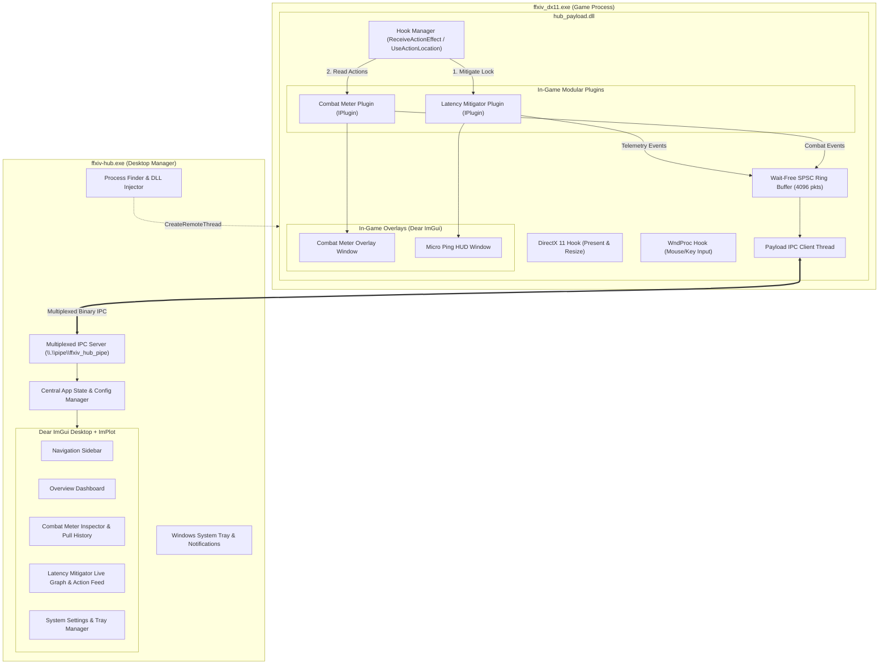

# FFXIV Hub 🎮⚡

[](https://github.com/mgauna-ar/ffxiv-hub/actions/workflows/ci.yml)


**FFXIV Hub** is a modern, unified, zero-dependency desktop manager and in-game suite for **Final Fantasy XIV (Dawntrail 7.x)** written in 100% C++20.

It combines high-precision combat analytics (**Combat Meter**) and client-side animation lock compensation (**Latency Mitigator**) into a single, unified architecture:
- **Single In-Game Injection**: One DLL (`hub_payload.dll`), one DirectX 11 hook, one `WndProc` hook, and one multiplexed Named Pipe.
- **Independent Floating Overlays**: Separate, draggable in-game overlays for each active plugin rendered directly onto Final Fantasy XIV's active DirectX 11 swapchain with 100% Variable Refresh Rate (VRR / G-Sync) compatibility.
- **Centralized Desktop Manager**: A modern desktop dashboard (`ffxiv-hub.exe`) powered by Dear ImGui (Docking) and ImPlot, featuring real-time latency graphs, action feeds, combat tables, historical pull drilldowns, and complete overlay configuration.
- **Zero External Dependencies**: Operates without Dalamud, XIVLauncher, Python runtimes, external web servers, or kernel filter drivers (WinDivert).

---

## 🏛️ Architecture Overview



---

## 🚀 Key Features

### ⚔️ Combat Meter Plugin
- **Real-Time Analytics**: Live DPS, HPS (effective healing vs overhealing), Crit%, Direct Hit%, and Crit-Direct Hit%.
- **Automatic Pet Attribution**: Automatically maps pet damage and abilities (Bahamut, Phoenix, Solar Bahamut, Carbuncle, Automaton Queen, Living Shadow, Eos, Selene) to their owner with zero orphan rows.
- **Encounter State Machine**: Automatic start on direct offensive/healing action, party wipe detection, and 7.0-second inactivity timeout with accurate duration calculation.
- **Analytical Drilldown**: Inspect per-action min/avg/max hits, swing counts, damage contribution, and hit severity distribution.

### ⚡ Latency Mitigator Plugin
- **Animation Lock Latency Compensation**: Eliminates double-weaving animation clip for players with higher ping by subtracting round-trip latency while strictly preserving native game timings.
- **Caster Tax & Slide-Cast Preservation**: Maintains the native 100ms cast completion lock so slide-casting and caster rotations remain perfectly synchronized with the server.
- **Anti-Cheat Guardrails**: Hard minimum animation lock floor (25.0ms) and moving-median spike rejection ($2.5\times$) prevent anomalous packet bursts or over-mitigation.
- **Real-Time RTT & Server Monitor**: Auto-detects active FFXIV game server IP via TCP connection inspection and displays smoothed round-trip ping.

### 🎮 Unified In-Game Payload & Overlays
- **Single Hook In-Game Pipeline**: Exactly one DirectX 11 hook (`Present` & `ResizeBuffers`), one non-destructive `WndProc` detour, and one unified `ReceiveActionEffect` hook executing Latency Mitigator first and Combat Meter second.
- **Independent Floating Overlays**: Separate, draggable Dear ImGui floating windows for the Combat Meter table and Latency Micro Ping HUD rendered directly onto the game's backbuffer with 100% VRR compatibility.
- **MRT Pipeline Protection**: Safely preserves and restores all 8 OM render target slots and depth-stencil view to protect FFXIV's deferred rendering pipeline.
- **Process Teardown Safety**: Graceful shutdown detection via `RtlDllShutdownInProgress` and non-destructive passthroughs to coexist seamlessly with ReShade and OBS.

### 🖥️ Desktop Manager & System Tray
- **Decoupled Architecture**: Strictly separates generic Hub lifecycle management from individual plugin diagnostics.
- **Sidebar Navigation**: Instant switching between Overview Dashboard, Combat Meter inspector, Latency Mitigator feed, and System Settings.
- **Plugin-Agnostic System Tray**: Lives unobtrusively in the Windows notification area with real-time status tooltip and context menu strictly managing Hub lifecycle (Show/Hide, Auto-Start, Config/Logs, Exit) without plugin clutter.
- **Dynamic Dashboard**: Displays FFXIV game process detection status, Named Pipe IPC server health, dynamically loaded plugins queried from `PluginRegistry` metadata, and Hub utility actions.
- **Dedicated Analytical Views**: Full-featured Combat Meter inspector (damage tables with job progress bars, healing breakdowns, pull history, action drilldowns) and Latency Mitigator inspector (real-time RTT curves, jitter cards, server monitor, rolling action feeds).
- **Debounced Geometry Persistence**: Overlay positions, dimensions, opacities, and scales automatically persist to `%APPDATA%/ffxiv-hub/config.json`.

---

## 🛠️ Build & Development

### macOS & Linux (Unit Tests)
All core calculations, timing algorithms, IPC serialization, and configuration logic can be compiled and verified natively on macOS:
```bash
make test
```

### Windows (Full Production Build)
Requires Visual Studio 2022 (MSVC C++20) and CMake 3.20+:
```cmd
cmake -B build -S . -DCMAKE_BUILD_TYPE=Release -A x64
cmake --build build --config Release
ctest --test-dir build -C Release --output-on-failure
```
Build outputs:
- `build/bin/Release/ffxiv-hub.exe`
- `build/bin/Release/hub_payload.dll`

### Packaging & Release Distribution
To generate the portable release ZIP package locally:
```cmd
cd build
cpack -G ZIP -C Release
```
Or via PowerShell:
```powershell
Compress-Archive -Path build/bin/Release/ffxiv-hub.exe, build/bin/Release/hub_payload.dll, README.md -DestinationPath ffxiv-hub-windows-x64.zip
```
The GitHub Actions CI/CD pipeline automatically compiles, tests, and publishes `ffxiv-hub-windows-x64.zip` with SHA256 checksums on all `v*.*.*` release tags and as workflow run artifacts on pushes to `main`.

---

## 📄 License & Fair Use
Final Fantasy XIV is a registered trademark of Square Enix Co., Ltd.
This project is an independent open-source utility designed for non-commercial educational and diagnostic purposes.
