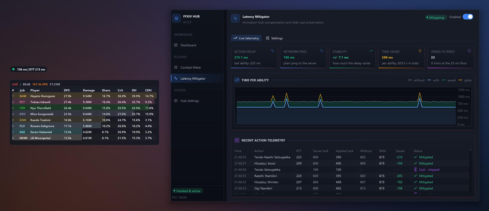
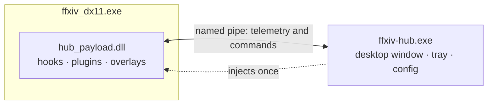

# FFXIV Hub

[](https://github.com/mgauna-ar/ffxiv-hub/actions/workflows/ci.yml)


[](LICENSE)

**A combat meter and a latency mitigator for Final Fantasy XIV, in one app with in-game
overlays.**

See the DPS, healing, deaths and buff uptime of every pull. Weave oGCDs on a 200 ms
connection the way you would sitting next to the datacenter. It comes as two files with
no installer.



[Highlights](#-highlights) · [Quick start](#-quick-start) · [Controls](#-controls) ·
[Safety](#-safety-and-fair-play) · [FAQ](#-troubleshooting-and-faq) ·
[Configuration](#-configuration) · [Building](#-building-from-source)

---

## ✨ Highlights

**⚔️ [Combat Meter](plugins/combat_meter/README.md) shows what happened in every pull.**

- Live DPS and HPS, with overheal kept out of HPS. Crit, direct hit and
  crit-direct-hit rates, and a per-action breakdown.
- rDPS, aDPS, nDPS and cDPS: the damage each raid buff added is credited to the player
  who gave it. One click above the Damage table switches between them.
- Pets are merged into their owners, and the Limit Break gets its own row, so the table
  holds your party and nothing else.
- Every death, with the killing blow, a recap of the hits and heals before it, and the
  time until the raise.
- Uptime for buffs, debuffs and DoTs, and damage taken per ability.
- What each player pressed: casts per minute, the GCD they ran at, and how much of the
  pull they kept it rolling.
- A timeline of each party member's damage, healing or damage taken across the pull,
  with the raid buff windows and the deaths on it.
- A pull history that splits when the game takes you out of combat, on a wipe, or on a
  zone change, so a boss's downtime never cuts a fight in two. Each visit to a duty is
  listed on its own and numbered from #1, and each pull shows whether the boss died, or
  how much HP it had left.

**⚡ [Latency Mitigator](plugins/latency_mitigator/README.md) lets you double-weave on a
high-ping connection.**

- Trims the animation lock by your measured round trip, so oGCDs weave as they would
  next to the datacenter.
- Measures your own latency and adapts. There is nothing to tune.
- Never goes below a 25 ms floor, never shortens cast locks (slide-casting still works),
  and never touches an action the server rejected.
- A small in-game badge shows your network ping and action round-trip time.

**🖥️ The app**

- In-game overlays drawn onto the game's own frame. Each one can be moved, scaled, faded,
  locked, made click-through, or hidden in certain situations.
- A desktop window for the details, and a tray icon that tells you whether it is attached.
- Every plugin can be switched off.
- Settings are saved as you change them.

---

## 📋 Requirements

- Windows 10 or 11, 64-bit.
- Final Fantasy XIV: Dawntrail (7.x), DirectX 11 client (`ffxiv_dx11.exe`).
- Administrator rights for FFXIV Hub ([why](#2-run-it-as-administrator)).

---

## 🚀 Quick start

### 1. Download and extract

Grab `ffxiv-hub-windows-x64.zip` from [Releases](../../releases) and extract it anywhere.
Keep both files in the same folder, because the app looks for the payload next to its own
executable:

```
ffxiv-hub/
├── ffxiv-hub.exe      # Desktop manager, system tray, injector
└── hub_payload.dll    # In-game hooks, overlays and telemetry
```

### 2. Run it as administrator

Right-click `ffxiv-hub.exe` → **Run as administrator**. This is required. Loading the
payload into the game means writing into another process's memory and starting a thread
there, and Windows does not allow that without elevation. Without it the Hub starts
normally but never attaches, and the dashboard shows *"Injection was refused."*

It opens the desktop manager and places an icon in the notification area. There is no
console window and nothing is installed.

> **Windows may warn you the first time.** The binaries are not code-signed. This is
> expected, and [the fix is two clicks](#-troubleshooting-and-faq).

### 3. Launch Final Fantasy XIV

Start the game through your normal launcher. The Hub finds `ffxiv_dx11.exe`, injects the
payload once the game window is ready, and shows a notification.

- Closing the game puts the Hub back into waiting.
- Closing the Hub leaves the game running and hides the overlays until you start it again.

### 4. Check it worked

- The sidebar and the dashboard read **Hooked & active**.
- Hovering the tray icon shows **Connected (PID …)**.

The sidebar badge is the short form of the connection status; hover it for the full line.

| Badge | Full status | Means |
|---|---|---|
| Searching for game | Searching for FFXIV... | The game is not running, or its window is not up yet. |
| Injecting | Injecting Payload... | The payload is being loaded into the game. |
| Connecting | Connecting Pipe... | The payload is loaded and has not answered yet. |
| Hooked & active | Connected (PID …) | Attached and working. |
| Hooks missing | Connected, hooks not installed (PID …) | The payload answered but could not hook the game, usually after a patch. |
| Reconnecting | Reconnecting to payload (PID …)... | The connection dropped while the game runs. The payload retries every 2 seconds on its own. |
| Unloaded | Payload unloaded. Restart the game to attach again. | You used **Unload payload** in this game session, even if the Hub was restarted since. A tray notification says the same. |
| Access denied | Access Denied (Run as Admin) | Windows refused access to the game. Run the Hub as administrator. |
- The combat meter and the ping badge appear in game. The badge's RTT reading fills in
  after your first ability, and the meter fills once you start fighting.

> **There is nothing to configure.** The Latency Mitigator measures your own round-trip
> time and adapts to it. You don't need to enter your ping or tune anything for it to work.

---

## 🎮 Controls

**In game**

- **Drag** an unlocked overlay to move it. The combat meter can also be resized from its
  edges; the ping badge sizes itself.
- **Right mouse is never captured**, even over an overlay, so camera rotation and
  targeting always reach the game.
- Everything else is set per overlay, under the plugin's **Settings → In-game overlay**:
  - show or hide it
  - lock it in place
  - click-through, which passes the mouse to the game
  - opacity and scale
  - when to hide it

**Hide conditions** apply only while the overlay is locked, so an unlocked overlay can
always be found and dragged back. Each overlay can:

- show always, only in combat, or only out of combat. Shown only in combat, it stays up
  for a set number of seconds after combat ends, 5 by default
- show only in duty content
- hide during cutscenes, on loading screens, or while a menu is open

**Desktop window**

| Page | What's on it |
|---|---|
| Dashboard | Whether the game was found and the payload hooked, network ping, IPC traffic, and a card per plugin with its master switch |
| Combat Meter | Damage, Healing, Damage Taken, Deaths, Buffs & Debuffs, Casts, and Timeline for the live pull and every archived one, plus Settings |
| Latency Mitigator | Live latency stats, the round-trip graph and a feed of every action, plus Settings |
| Hub Settings | Start with Windows, close to tray, notifications, the config file, reset, unload, and the diagnostic log |

**Tray icon.** Click it to open the window, hover over it for the connection status (the
same wording as the sidebar), or right-click for the menu:

| Item | What it does |
|---|---|
| Open FFXIV Hub | Shows the desktop window. |
| Start with Windows | Launches the Hub when you log on. |
| Open Logs Folder | Opens the folder that holds `hub.log`. |
| Open Configuration File | Opens `config.json` in your editor. |
| Exit | Closes the Hub. The game keeps running. |

---

## 🧩 Plugins

Each plugin has a master switch. Off means it consumes no game hooks, streams no
telemetry and draws no overlay. Flip it from the plugin's page or its dashboard card.

| Plugin | What it does |
|---|---|
| [**Combat Meter**](plugins/combat_meter/README.md) | DPS and HPS with overheal separated, rDPS/aDPS/nDPS/cDPS from raid buff credit, crit/DH/CDH rates, automatic pet attribution, deaths with killing blow and recap, buff/debuff/DoT uptime, damage taken by ability, casts and GCD uptime, a per-second timeline with raid buff windows, encounter tracking and pull history with the boss's HP left |
| [**Latency Mitigator**](plugins/latency_mitigator/README.md) | Animation lock compensation for clean double-weaving on high latency, with a live ping and RTT HUD |

Each plugin's README covers how it works, its in-game overlay, its desktop view and its
configuration keys.

---

## 🔒 Safety and fair play

FFXIV Hub runs entirely on your PC and stays within what the server already allows:

- **What it reads.** Combat results as the game receives them. The names, jobs, HP and
  status effects of your party and of the enemies you are fighting.
- **The one thing it writes.** Your local animation-lock timer, after the server has
  already confirmed the action.
  - It never sets the timer below a 25 ms floor.
  - It leaves cast locks alone.
  - It skips rejected actions and locks over 2.5 s.

  Turn off *Enable animation lock mitigation*, or switch on *Dry-run mode*, and it writes
  nothing at all. The Combat Meter only ever reads.
- **What it never does.** Modify, send or delay network packets. Automate any input.
  Change cooldowns or the GCD.
- **Nothing leaves your PC.** The only network traffic the Hub makes is an ICMP ping to
  the game server you are already connected to.
- **It goes quiet when you close it.** With the Hub closed, the payload is dormant until
  the Hub reconnects: the overlays hide, mitigation stops and nothing is queued for the
  Hub. The combat meter keeps counting in the background.

**Keep it to yourself.** Square Enix takes action when a third-party tool is brought up
in game or used against other players. So don't mention it in chat, and never use its
numbers to call anyone out.

---

## ❓ Troubleshooting and FAQ

<details>
<summary><b>Windows Defender or SmartScreen flags the download</b></summary>

<br>

This is expected, and it is safe to allow. The Hub loads its payload into the game with
standard Windows APIs (`VirtualAllocEx` and `CreateRemoteThread`), the same mechanism a
debugger uses.

Antivirus heuristics flag *any* unknown binary that does this, unless it carries an
Extended Validation code-signing certificate. Those cost several hundred dollars a year,
which an open-source hobby project doesn't pay.

Click **More info → Run anyway**, or add an exclusion. The entire source is in this
repository, and you can [build it yourself](#-building-from-source).

</details>

<details>
<summary><b>It never attaches to the game</b></summary>

<br>

The most common cause is not running the Hub as administrator ([step 2](#2-run-it-as-administrator)).
The Hub tells you when this is the problem: the dashboard reads *"Injection was refused.
Run FFXIV Hub as administrator."* and `hub.log` records the access-denied error with the
game's PID. The Hub needs elevation even when you didn't start the game or its launcher as
administrator.

If the dashboard reads *Payload unloaded*, the payload was unloaded earlier in this game
session. Restart the game.

</details>

<details>
<summary><b>The overlays are not showing up</b></summary>

<br>

Check these in order:

1. You are logged in to a character. The overlays stay hidden on the title screen and
   character select.
2. The plugin's master switch is on (its dashboard card or its page header).
3. The overlay itself is on in that plugin's **Settings → In-game overlay** (*Show in-game
   meter* or *Show micro ping HUD*).
4. The overlay's hide conditions. A locked overlay can be set to show only in combat,
   only in duties, or to hide in cutscenes, on loading screens and in menus.

</details>

<details>
<summary><b>An overlay won't hide in cutscenes, or out of combat</b></summary>

<br>

Hide conditions apply only while the overlay is locked. Otherwise an overlay could hide
itself somewhere you couldn't drag it back from. Lock it in its settings (*Lock meter
position & size* or *Lock HUD position*).

</details>

<details>
<summary><b>An overlay is in the way of my clicks</b></summary>

<br>

Turn on *Click-through mode* in its settings, and every click passes to the game. Right
mouse always goes to the game anyway, so the camera never catches on an overlay.

</details>

<details>
<summary><b>Where are the logs?</b></summary>

<br>

`%APPDATA%/ffxiv-hub/hub.log`. **Hub Settings** shows it live, and the tray's *Open Logs
Folder* takes you to it.

</details>

<details>
<summary><b>How do I stop it, or uninstall it?</b></summary>

<br>

Exit from the tray menu. The game keeps running, untouched: the overlays disappear and
mitigation stops. The combat meter keeps counting in the background.

The payload stays loaded for the rest of that game session by design. Unloading code
from under a running DirectX pipeline is riskier than leaving it dormant. While the Hub
is closed it only keeps the combat meter counting, and reconnects within a second when
you open the Hub again.

To switch it off for the rest of the session, use **Hub Settings → Unload payload**. Its
hooks become pass-throughs and it stops talking to the Hub, which then reads **Payload
unloaded**. The DLL itself stays in the game's memory, for the same reason as above, so
the Hub cannot attach again until you restart the game; after the restart it attaches as
usual.

To uninstall, delete the folder you extracted. Settings live in `%APPDATA%/ffxiv-hub/`;
delete that too if you want no trace left.

</details>

<details>
<summary><b>Final Fantasy XIV just patched and it stopped working</b></summary>

<br>

A patch can move the memory locations the Hub relies on. Check [Releases](../../releases)
for an updated build. Nothing is damaged in the meantime: if the Hub can't find what it
needs, it reports the failure and does not attach.

</details>

<details>
<summary><b>Why is the RTT higher than my ping? Should I raise the target ping?</b></summary>

<br>

They measure different things, and no, you shouldn't. Both are answered in the
[Latency Mitigator FAQ](plugins/latency_mitigator/README.md#faq).

</details>

---

## 🔧 Configuration

Everything is set from the desktop app. `%APPDATA%/ffxiv-hub/config.json` is where it is
stored, not the intended interface. The file has one section for the Hub and one per
plugin:

```jsonc
{
  "hub":               { /* the keys below */ },
  "combat_meter":      { /* see the Combat Meter README */ },
  "latency_mitigator": { /* see the Latency Mitigator README */ }
}
```

- **Saving.** Changes are saved as you make them; a slider is saved once, when you let go
  of it. The running game also saves overlay
  state every few seconds, such as a HUD you just dragged. It writes only the plugin
  settings it uses, merged into the file as it is on disk, so it never reverts a Hub
  setting or one only the desktop app reads.
- **Resetting.** **Hub Settings → Reset all settings** puts every key back to its default,
  in the app and in game, and switches every plugin back on. *Start with Windows* keeps
  following the registry.

Hub keys:

| Key | Type | Default | Description |
|---|---|---|---|
| `start_with_windows` | bool | `false` | Launch automatically on Windows logon. |
| `minimize_to_tray` | bool | `true` | Closing the window hides it to the notification area instead of exiting. |
| `show_notifications` | bool | `true` | Windows notifications on attach and detach. |

Plugin keys are documented in [Combat Meter](plugins/combat_meter/README.md#configuration)
and [Latency Mitigator](plugins/latency_mitigator/README.md#configuration).

---

## 🔬 Under the hood



- **One payload, one of each hook.** The Hub injects a single DLL, which installs:
  - one DirectX 11 hook
  - one window-procedure hook
  - one detour on the game's action-effect handler, which hands each packet to the
    plugins in a fixed order
- **Analytics in the game, detail on the desktop.** The plugins run inside the payload,
  so overlays update without a round trip. The same events stream to the desktop app as
  framed binary packets over a single named pipe.
- **Stays out of the way.**
  - Close the Hub and the payload goes dormant. Start it again and it reconnects within
    a second, without hooking anything twice.
  - Overlays restore every render target they touch.
  - Game memory is only read inside exception guards, so a bad read after a patch fails
    safely.
  - The named pipe admits only your own Windows user, so another account or service on
    the machine cannot send the payload commands.
- **Portable core.** The analytics, timing math, IPC protocol and config are plain C++20
  with no Windows headers, so the whole test suite also runs on macOS and Linux.

The full runtime topology, and the invariants any change has to keep, are in
[AGENTS.md](AGENTS.md).

---

## 📁 Project layout

```
ffxiv-hub/
├── include/hub/                 Plugin interfaces and descriptors, the version, shared types,
│                                game offsets and signatures
├── src/common/                  IPC, config, signature scanning, OS integration, shared UI
├── src/payload/                 The injected DLL: hooks, overlay host, game memory readers
├── src/app/                     The desktop manager: app state, views, entry point
├── plugins/combat_meter/        Combat Meter: analytics core, in-game table, plugin glue
├── plugins/latency_mitigator/   Latency Mitigator: RTT tracking, lock math, ping HUD
├── tests/                       Unit tests, runnable on Windows, macOS and Linux
└── tools/                       Table generators, signature checks, game-client inspection,
                                 README screenshots
```

Each part under `src/` and `plugins/` keeps its headers in `include/<name>/` and its
sources in `src/`. A part is built against only its own `include/` folder and those of
the parts it may use, so a plugin cannot include the payload's or the app's headers.

---

## 🔨 Building from source

### Tests (macOS, Linux or Windows)

You need a C++20 compiler and GNU `make`. `make` uses `clang++`; `make CXX=g++` picks
g++. g++ 13 and clang 18 to 20 all build it with warnings as errors, and CI builds it
with both.

```bash
make
```

This builds and runs the unit test suite, syntax-checks the desktop UI code with Dear
ImGui enabled, and compiles every header on its own to check that it only includes what
its part may use. The build is incremental: objects go to `build/test/`, so after an
edit only the files it affects recompile. `make clean` removes the build outputs.

The same suite also runs under the sanitizers, each built into its own folder under
`build/`. Clang needs its sanitizer runtime for these (`libclang-rt-18-dev` on Ubuntu):

```bash
make tsan    # ThreadSanitizer
make asan    # AddressSanitizer + UndefinedBehaviorSanitizer
```

macOS has no LeakSanitizer, so there `make asan` runs without leak detection.

### README screenshots (macOS or Linux)

The pictures in `docs/images/` are drawn by the desktop app's and the overlays' own code
into a software rasterizer, over a made-up raid night, so they can be redrawn without
Windows or the game. You need zlib, `curl` and `shasum` as well:

```bash
make screenshots
```

The first run downloads Selawik, Microsoft's openly licensed (OFL) stand-in for Segoe UI,
and checks its SHA-256. To draw with other fonts, set `SHOTS_WINDOWS_DIR` to a folder
whose `Fonts` subfolder holds `segoeui.ttf`, `segoeuib.ttf` and `seguisb.ttf`. The party,
its numbers and the boss HP are invented; the source is in `tools/screenshots/`.

The night is fixed down to its wall clock, and the tool runs in UTC, so redrawing on the
same machine writes the same files. Another compiler or platform can still move a few
antialiased pixels, so commit only the pictures a change actually alters.

### Windows binaries

You need Visual Studio 2022 with *Desktop development with C++*, and CMake 3.22+:

```cmd
cmake -B build -S . -A x64
cmake --build build --config Release
ctest --test-dir build -C Release --output-on-failure
```

The build writes `build/bin/Release/ffxiv-hub.exe` and `build/bin/Release/hub_payload.dll`.
It treats warnings in the project's own code as errors (`/W4 /WX`); the vendored ImGui and
MinHook keep their own warning levels.
To produce the portable ZIP:

```cmd
cd build
cpack -G ZIP -C Release
```

This writes `ffxiv-hub-windows-x64.zip`, with the two binaries at its root: the same file
a release publishes.

The GitHub Actions workflow builds and tests every push to `main`, and uploads the result
as a workflow artifact. On a `v*.*.*` tag it also publishes `ffxiv-hub-windows-x64.zip`,
as a release, whose page shows its SHA256; the tag must match the version in
`include/hub/version.hpp`.

---

## 📚 Documentation

| Document | What it covers |
|---|---|
| [Combat Meter README](plugins/combat_meter/README.md) | How pulls, pets, deaths, casts, uptime and the timeline are tracked; its views and settings |
| [Latency Mitigator README](plugins/latency_mitigator/README.md) | How the lock is adjusted and what is left alone; its HUD, view and settings |
| [AGENTS.md](AGENTS.md) | Architecture, runtime topology, and the invariants every change must keep |
| [Combat Meter AGENTS.md](plugins/combat_meter/AGENTS.md) · [Latency Mitigator AGENTS.md](plugins/latency_mitigator/AGENTS.md) | Plugin-specific rules, and what was verified about the game client |
| [`.claude/skills/`](.claude/skills/) | Procedures: after a game patch, inspecting the game client, the ThreadSanitizer run, cutting a Windows release |

---

## 📄 License

MIT. See [LICENSE](LICENSE).

Bundled third-party code:

- **Dear ImGui** (MIT), vendored under `src/third_party/imgui/`.
- **MinHook** (BSD-2-Clause), vendored under `src/third_party/minhook/`.
- **Lucide icons** (ISC). A subset is embedded in
  `src/common/include/common/ui/icons_font.inl`; regenerate it with
  `tools/embed_icon_font.py`.

FINAL FANTASY XIV © SQUARE ENIX CO., LTD. FINAL FANTASY is a registered trademark of
Square Enix Holdings Co., Ltd. FFXIV Hub is an independent project and is not affiliated
with or endorsed by Square Enix.
