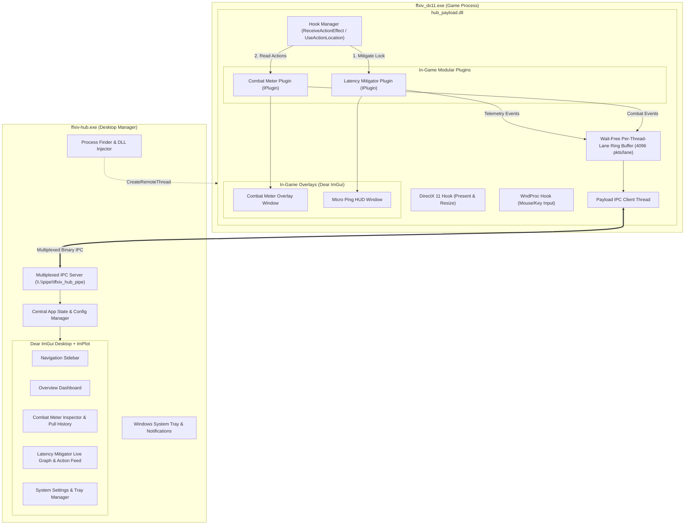

# FFXIV Hub 🎮⚡

[](https://github.com/mgauna-ar/ffxiv-hub/actions/workflows/ci.yml)


**FFXIV Hub** is a modern, unified, zero-dependency desktop manager and in-game suite for **Final Fantasy XIV (Dawntrail 7.x)** written in 100% C++20.

It combines high-precision combat analytics (**Combat Meter**) and client-side animation lock compensation (**Latency Mitigator**) into a single, unified architecture:
- **Single In-Game Injection**: One DLL (`hub_payload.dll`), one DirectX 11 hook, one `WndProc` hook, and one multiplexed Named Pipe.
- **Independent Floating Overlays**: Separate, draggable in-game overlays for each active plugin rendered directly onto Final Fantasy XIV's active DirectX 11 swapchain with 100% Variable Refresh Rate (VRR / G-Sync) compatibility.
- **Centralized Desktop Manager**: A modern desktop dashboard (`ffxiv-hub.exe`) powered by Dear ImGui (Docking) and ImPlot, featuring real-time latency graphs, action feeds, combat tables, historical pull drilldowns, and complete overlay configuration.
- **Zero External Dependencies**: Operates without Dalamud, XIVLauncher, Python runtimes, external web servers, or kernel filter drivers (WinDivert).

---

## 🏛️ Architecture Overview



---

## 🚀 Quick Start

### 1. Download & extract

Grab `ffxiv-hub-windows-x64.zip` from the [Releases](../../releases) tab and extract it
anywhere. Keep both files in the same folder — the app resolves the payload next to its
own executable:

```
ffxiv-hub/
├── ffxiv-hub.exe      # Desktop manager, system tray, injector
└── hub_payload.dll    # In-game hooks, overlays and telemetry
```

### 2. Run it

Double-click `ffxiv-hub.exe`. It opens the desktop manager and places an icon in the
notification area. There is no console window and nothing is installed.

### 3. Launch Final Fantasy XIV

Start the game through your normal launcher. The Hub discovers `ffxiv_dx11.exe`, injects
the payload once the game window is ready, and reports the attachment in the dashboard and
as a notification. Closing the game returns it to a waiting state; closing the Hub leaves
the game running and hides the overlays until you start it again.

---

## 🧩 Plugins

Each plugin has a master switch — off means it consumes no game hooks, streams no
telemetry and draws no overlay, not merely that its view is hidden. Toggle it from the
plugin's page or its dashboard card.

| Plugin | What it does |
|---|---|
| [**Combat Meter**](plugins/combat_meter/README.md) | DPS and HPS with overheal separated, crit/DH/CDH rates, automatic pet attribution, deaths with killing blow and recap, buff/debuff/DoT uptime, damage taken by ability, encounter tracking and pull history |
| [**Latency Mitigator**](plugins/latency_mitigator/README.md) | Animation lock compensation for clean double-weaving on high latency, with a live ping/RTT HUD |

Each plugin's own README documents how it works, its in-game overlay, and its
configuration keys.

---

## 🚀 Key Features

### 🎮 Unified In-Game Payload & Overlays
- **Single Hook In-Game Pipeline**: Exactly one DirectX 11 hook (`Present` & `ResizeBuffers`), one non-destructive `WndProc` detour, and one unified `ReceiveActionEffect` hook fanning out to every registered hook consumer in registration order.
- **Independent Floating Overlays**: Separate, draggable Dear ImGui floating windows for the Combat Meter table and Latency Micro Ping HUD rendered directly onto the game's backbuffer with 100% VRR compatibility.
- **MRT Pipeline Protection**: Safely preserves and restores all 8 OM render target slots and depth-stencil view to protect FFXIV's deferred rendering pipeline.
- **Process Teardown Safety**: Graceful shutdown detection via `RtlDllShutdownInProgress` and non-destructive passthroughs to coexist seamlessly with ReShade and OBS.

### 🖥️ Desktop Manager & System Tray
- **Decoupled Architecture**: Strictly separates generic Hub lifecycle management from individual plugin diagnostics.
- **Sidebar Navigation**: Instant switching between Overview Dashboard, Combat Meter inspector, Latency Mitigator feed, and System Settings.
- **Plugin-Agnostic System Tray**: Lives unobtrusively in the Windows notification area with real-time status tooltip and context menu strictly managing Hub lifecycle (Show/Hide, Auto-Start, Config/Logs, Exit) without plugin clutter.
- **Hub-Only Dashboard**: Displays FFXIV game process detection status, Named Pipe IPC server health, hub-measured network ping, payload hook state, and the registered plugins queried from `PluginRegistry` metadata. No plugin metrics: DPS, HPS and mitigation numbers live only in their own views.
- **Per-Plugin Master Switch**: Every plugin can be switched off outright, from its dashboard card or its own page header. A disabled plugin consumes no game hooks, streams no telemetry and draws no in-game overlay; the choice persists to `config.json` and is re-applied when the payload next loads.
- **Dedicated Analytical Views**: Full-featured Combat Meter inspector (damage tables with job progress bars, healing breakdowns, damage taken by ability, a death log with recaps, buff and debuff uptime, a pull list rail for switching between the live fight and archived pulls, action drilldowns) and Latency Mitigator inspector (real-time RTT curves, jitter cards, rolling action feeds). Both share one page frame, so the Settings tab lists the same sections - Plugin, In-game overlay, Display, Maintenance - in the same order for every plugin.
- **Responsive Layout**: Card grids, stat tile rows and data tables reflow as the window resizes, down to an enforced minimum size; tables scroll horizontally rather than crushing their columns.
- **Debounced Geometry Persistence**: Overlay positions, dimensions, opacities, and scales automatically persist to `%APPDATA%/ffxiv-hub/config.json`.


---

## ⚙️ Configuration

Settings live in `%APPDATA%/ffxiv-hub/config.json`, written as you change them in the app.
Each plugin owns a section; hub-level keys are:

| Key | Type | Default | Description |
|---|---|---|---|
| `start_with_windows` | bool | `false` | Launch automatically on Windows logon. |
| `minimize_to_tray` | bool | `true` | Closing the window hides to the notification area instead of exiting. |
| `show_notifications` | bool | `true` | Windows notifications on attach and detach. |
| `refresh_interval_ms` | int | `500` | How often the desktop views refresh. |

Plugin keys are documented in
[Combat Meter](plugins/combat_meter/README.md#configuration) and
[Latency Mitigator](plugins/latency_mitigator/README.md#configuration).

---

## 🛠️ Build & Development

### macOS & Linux (Unit Tests)
All core calculations, timing algorithms, IPC serialization, and configuration logic can be compiled and verified natively on macOS:
```bash
make test
```

### Windows (Full Production Build)
Requires Visual Studio 2022 (MSVC C++20) and CMake 3.20+:
```cmd
cmake -B build -S . -DCMAKE_BUILD_TYPE=Release -A x64
cmake --build build --config Release
ctest --test-dir build -C Release --output-on-failure
```
Build outputs:
- `build/bin/Release/ffxiv-hub.exe`
- `build/bin/Release/hub_payload.dll`

### Packaging & Release Distribution
To generate the portable release ZIP package locally:
```cmd
cd build
cpack -G ZIP -C Release
```
Or via PowerShell:
```powershell
Compress-Archive -Path build/bin/Release/ffxiv-hub.exe, build/bin/Release/hub_payload.dll -DestinationPath ffxiv-hub-windows-x64.zip
```
The GitHub Actions CI/CD pipeline automatically compiles, tests, and publishes `ffxiv-hub-windows-x64.zip` with SHA256 checksums on all `v*.*.*` release tags and as workflow run artifacts on pushes to `main`.

---

## 📄 License & Fair Use

Bundled third-party assets:
- **Dear ImGui** (MIT) - vendored under `src/third_party/imgui/`.
- **MinHook** (BSD-2-Clause) - vendored under `src/third_party/minhook/`.
- **Lucide icons** (ISC) - a 50-glyph subset is embedded in `src/common/ui/icons_font.inl`;
  regenerate it with `tools/embed_icon_font.py`.

Final Fantasy XIV is a registered trademark of Square Enix Co., Ltd.
This project is an independent open-source utility designed for non-commercial educational and diagnostic purposes.
