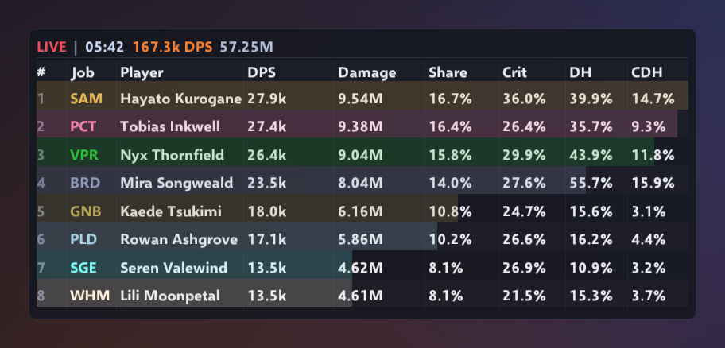
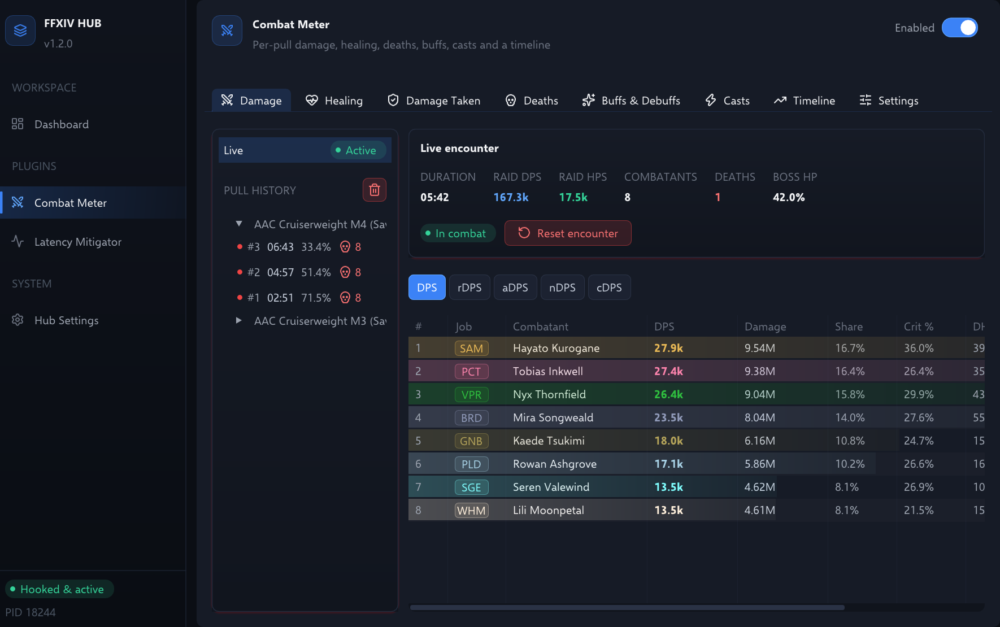

# ⚔️ Combat Meter

Real-time damage and healing analytics: DPS, HPS with overheal separated out, crit and
direct hit rates, per-action breakdowns, and a pull history. Each pull also records who
died and to what, which debuffs the party picked up, how long buffs and DoTs stayed up,
and the damage every player took, by ability.

Part of [FFXIV Hub](../../README.md). Enable or disable it from its page in the desktop
app, or from its card on the dashboard.

<!--  -->

## At a glance

- **Honest numbers.** A pull's clock starts on the first hit that lands and stops at the
  last action, not at the timeout. HPS counts effective healing only.
- **One row per player.** Pets are merged into their owners, and the Limit Break gets its
  own row that is never counted toward anyone's DPS.
- **Credit for buffs.** rDPS moves the damage a raid buff added to whoever gave it, so a
  player who buffs the party ranks for what they bring.
- **Why a pull went wrong.** Every death, with its killing blow, a recap of the seconds
  before it, the statuses held at the time, and how long the raise took. Damage taken is
  broken down by ability.
- **Uptime you can trust.** Buffs, debuffs and DoTs are tracked per target and per source.
  A status that expires between reads is closed at its own timer, so uptime isn't rounded
  to the polling interval.
- **Every pull kept.** Pulls split on their own after inactivity, on a wipe, or on a zone
  change, and are listed by duty with a clear or wipe badge.

---

## How encounters are tracked

### Starting and ending a pull

An encounter starts on the first direct action that deals damage. Blocked and parried
hits count, since those are mitigated rather than avoided.

Healing, shields, buffs, debuffs and whiffs never start one. Prepull topping-off and
prepotting is preparation, not combat, and opening a pull on it meant the clock was
already running — and the healer already ranked — before anyone had touched the boss.
Damage-over-time and heal-over-time ticks never start one either, or a lingering DoT on a
mob you walked away from would open a pull on its own.

Once the pull is underway, healing counts as normal, both toward HPS and as activity that
holds off the inactivity timeout.

It ends in one of four ways:

1. **Inactivity** — 7 seconds with no combat activity splits the encounter and archives it.
2. **Wipe** — every synced party member confirmed dead. One survivor, or a raise, cancels it.
   Party HP is read from the party list on each sync (every 1.5 s); a death or a raise is
   republished to the desktop app so both sides see the wipe. A member whose HP has never
   been read is not counted as dead. Solo, the party is you alone: your own HP is read on
   the same schedule, and nobody else you have come across counts.
3. **Zone change** — any in-progress pull is finalised and archived. The zone is read from
   the party list, so solo play has no zone and pulls are filed under *Unknown zone*.
   Going solo mid-pull (the party disbanding) is not a zone change: the pull carries on
   and keeps the zone it started in.
4. **Manual** — ended from the desktop app.

Duration is measured to the *last combat action*, not to the moment the timeout fired, so
a 7-second gap does not inflate the pull and deflate everyone's DPS. Wipes and zone
changes are trimmed the same way, since both are also detected after the fact. Only a
manual end takes the full elapsed time.

### Pet attribution

Pet damage belongs to the owner. When a pet acts — Demi-Bahamut's Akh Morn, Automaton
Queen's Pile Bunker, Living Shadow's Shadowbringer — the registry maps its entity id back
to the player and merges the stats there:

- Unlinked pets are attributed by matching party and local player jobs.
- Late attribution packets consolidate into the owner rather than leaving a stray row.
- A pet's link to its owner ends when its entity id comes back as something else, so a
  monster reusing that id is never merged into the old owner.
- Pet damage counts toward the player's total and DPS.
- It is also tracked separately, so you can see how much of a total came from the pet.
  A pet attributed late counts once toward that figure, and if the owner had no row yet,
  the merged row takes the owner's name and job rather than the pet's.
- Pet skills appear in the player's own per-action breakdown.

The result is no orphan rows: a raid table shows eight players, not eight players and
six pets.

### Healing and overheal

HPS is effective healing only. Overhealing is tracked and shown, but never counted toward
HPS — a healer topping off full-health party members should not out-rank one whose healing
landed. Total healing is effective plus overheal, and the overheal percentage is measured
against that total.

Overheal is worked out in-game, as each heal is decoded: the heal is compared against how
much HP its target was missing, read from the game at that moment. The game applies the HP
change in a later packet, so that reading is still the pre-heal value. The split is made
before the packet goes to the desktop app, so both views agree. A self-heal carried on an
attack (a drain) is measured against the caster, not the enemy. Two heals landing on the
same target before the game applies either one both see the same missing HP, so overheal
is slightly under-counted in that case.

HoT ticks are split the same way as they land. A tick carries no HP of its own, and the
game may update the target's HP just before or just after it. A tick on a target already
at full counts as overheal either way. When the update comes first, a tick landing while
the target is missing less than two ticks' worth of HP can count up to one tick more
overheal than it should.

### Limit Break

The game reports the casting player as the source of a Limit Break, so attributing it by
source would hand one player a large chunk of the raid's damage. It is identified by
action id instead and routed to its own synthetic row. It counts toward raid DPS, and
never toward any individual's damage, DPS or share.

### Raid buffs: rDPS, aDPS, nDPS and cDPS

Part of every buffed hit belongs to whoever gave the buff. The meter works out that part
for each hit from the buffs in effect when it landed, and moves it to the player who
applied them. That gives five damage rates:

| Rate | What it counts |
|---|---|
| **DPS** | Damage dealt. |
| **rDPS** | Damage dealt, less what other players' buffs added to it, plus what your buffs added to theirs. The party's rDPS adds up to its DPS. |
| **aDPS** | Damage dealt, less what cards and dance partner effects added to it. |
| **nDPS** | Damage dealt, less what every other player's buffs added to it. |
| **cDPS** | aDPS, plus what your buffs added to other players' damage. |

*DPS metric* in Settings picks the rate the meter shows and ranks by, in game and on the
desktop.

How each buff's part is measured:

- A damage buff earns its percentage of the hit.
- A critical hit or direct hit rate buff earns only when the hit crits or direct hits,
  in proportion to its share of the chance. A 10% crit buff on a player who crits 22% of
  the time on their own made about a third of their crits.
- On a hit that always crits or direct hits, such as Midare Setsugekka, Inner Chaos or a
  Reassembled weaponskill, the game turns rate buffs into extra damage instead, and the
  buff earns that.
- Several buffs on one hit share its extra damage in proportion to how much each raised it.
- A damage-over-time effect keeps the buffs it was applied under. Its ticks show no crit,
  so a rate buff earns what it adds on average.
- Pets fight under their owner's buffs.
- A player's own buffs stay part of their own damage, and the Limit Break is never
  credited.

A buff's strength comes from the game's own descriptions: Technical and Standard Finish
by the steps danced, Radiant Finale by the codas sung, the Balance and the Spear by the
receiving player's role.

Crit and direct hit rates are estimated. The meter learns each player's own rates from
the hits no rate buff touched, starting from a typical rate until it has seen enough of
them. Credit for damage buffs is exact; credit for rate buffs is close.

The buffs followed are Arcane Circle, Army's Paeon, Battle Litany, Battle Voice,
Brotherhood, Chain Stratagem, Devilment, Divination, Dokumori, Embolden, Mage's Ballad,
Radiant Finale, Searing Light, Standard Finish, Starry Muse, Technical Finish, the
Balance, the Spear and the Wanderer's Minuet.

### Other behaviour worth knowing

- **Blocked and parried hits are still damage.** They carry a damage value and are counted
  as hits; the block and parry counters are extra, not a replacement.
- **Ticks have no severity.** DoT and HoT ticks carry no crit flag from the game, so they
  are counted separately and kept out of the denominator for crit, DH and CDH rates.
  Including them would dilute every rate toward zero.
- **Only damage and heal ticks count.** The game's tick handler also delivers MP and
  job-gauge gains, such as Dancer's Esprit. They are neither damage nor healing and are
  ignored.
- **Enemy damage to players** is tracked as damage taken on the target, and never added to
  raid DPS. Each hit of an AoE is booked on the target it actually hit, so a self-centred
  AoE never lands on its caster and a raidwide never lands on the boss.
- **Crit and direct hit** come from the game's own flags only: `0x20` and `0x40` on a
  hit's severity byte, and `0x20` on the byte after it for a heal. Heals never direct hit.

---

## Deaths, buffs and debuffs

Action packets say what hit whom, but not who died or what statuses anyone had. The meter
gets both by reading the game four times a second: HP for every party member (the local
player when solo), and the status list of each party member and of the four enemies taking
the most damage. The reads never start a pull and never keep one open: a buff ticking down
is not combat. `track_vitals` switches the polling off entirely, and the Deaths and
Buffs & Debuffs tabs then stay empty.

### Deaths

A party member whose HP drops to 0 is recorded as a death, and one who comes back as a
raise. Each death keeps:

- **The killing blow**, which is the last damage that landed before it, with its source and amount.
- **A recap** of the last ten hits, heals and ticks within 12 seconds before it.
- **The statuses the player had** when they died, debuffs first.
- **How long it took to be raised.**

The damage-taken row of the killing blow counts the death too, so the ability that killed
most often stands out. A wipe is sometimes noticed a moment before the last deaths arrive.
Deaths up to 5 seconds after the pull ended still count toward it.

### Buffs and debuffs

Each status is tracked per target and per source over the pull: how many times it was
applied, how long it stayed up, and its uptime against the pull's duration. A buff that was
already up when the pull started counts from the first second. A status that expires
between two reads is closed at its own timer, not at the read, so an uptime is exact to
the timer rather than to the polling interval. Debuff and buff come from the game's own
Status sheet category.

On enemies, only statuses the party applied are kept, such as DoTs and raid debuffs.
Enemy status lists are dropped when a pull ends, so a debuff on a dead or despawned enemy
never carries into the next pull. Party members out of range still report their statuses,
from the party list's copy, but that copy has no timers or sources.

### Damage taken

Every hit, DoT tick included, that lands on a party member is booked per player, ability
and source: hits, total, average, largest hit, and deaths caused.

---

## Views

**In-game overlay.** A draggable, resizable table showing the current encounter.

- It shows one metric at a time, damage or healing, chosen by `overlay_metric`.
- Rows carry the combatant's job colour. The colour comes from the hub's shared job style
  table, so the overlay and the desktop always agree.
- The Job column shows a three-letter abbreviation. Hover it for the full job name, or
  *Limit Break* on the LB row.
- It is hidden while the Hub is closed. The meter keeps counting in the background.

<!--  -->

**Desktop view.** Six tabs: **Damage**, **Healing**, **Damage Taken**, **Deaths**,
**Buffs & Debuffs**, and **Settings**. Every tab but Settings shows a pull list rail on
the left. The live fight is at the top, then the pull history grouped by duty: each pull
has an outcome dot (gold clear, red wipe, grey timeout), its number and duration, then
its death count and end time while the rail has room for them. Hovering a pull shows all
of it. The trash button in the history header clears the archive after asking. The rail
is the only place a pull is chosen, and it narrows on a small window. Beside it:

- **Damage** and **Healing**: the selected pull's rankings. Damage has share, crit, direct
  hit and crit-direct-hit rates, job-coloured bars and a Deaths column. Its rate column
  shows the *DPS metric*; hover it for all five rates. Healing has total, effective and
  overheal. Selecting a row opens a per-ability breakdown in the tab's own metric, damage
  or effective healing: hits, total, min/avg/max and crit rate. A damage breakdown first
  lists the buff damage the player received and gave, and from and to whom.
- **Damage Taken**: each player's damage taken, hits and deaths. Below it, the abilities
  that hit the selected player, or everyone.
- **Deaths**: every death with its time, killing blow, source, debuffs and time to raise.
  Selecting one opens its recap.
- **Buffs & Debuffs**: debuffs on the party, buffs on the party, and statuses on the
  enemies. Each status has its applications, time and uptime, and expands into each
  player or source.

The in-game overlay stays a damage or healing table; the other views are desktop only.

**Settings**

| Section | Controls |
|---|---|
| Meter behaviour | *Party members only*, *Track deaths, buffs and debuffs*, *Hide idle combatants*, *Overlay refresh*, *End encounter after idle* |
| In-game overlay | The shared overlay controls: visibility, lock, click-through, opacity, scale and hide conditions |
| Meter display | *Meter metric*, *DPS metric*, *Job-coloured row bars*, and a toggle for each of the share, crit, direct hit and crit-direct-hit columns |
| Maintenance | *Reset overlay position*, *End encounter*, *Reset all statistics* |

Job colours are per-job, not per-role, and live in `src/common/ui/job_style.cpp` as the
single source of truth.

---

## Configuration

Stored in the `combat_meter` section of `%APPDATA%/ffxiv-hub/config.json`. Everything here
is editable from the plugin's page in the desktop app; the file is the persistence format,
not the intended interface.

| Key | Type | Default | Description |
|---|---|---|---|
| `plugin_enabled` | bool | `true` | Master switch. Off means no hook dispatch, no telemetry, no overlay. |
| `inactivity_timeout_seconds` | float | `7.0` | Gap that splits one encounter from the next. |
| `party_only` | bool | `false` | In-game overlay only: restrict rows to the synced party and the Limit Break row. Solo there is no party list, so it keeps every friendly row. |
| `show_bars` | bool | `true` | Job-coloured progress bars behind rows. |
| `hide_inactive` | bool | `false` | Hide combatants with no activity. |
| `refresh_interval_ms` | int | `500` | How often the displayed snapshot refreshes. |
| `show_col_share` | bool | `true` | Show the damage share column. |
| `show_col_crit` | bool | `true` | Show the crit rate column. |
| `show_col_dh` | bool | `true` | Show the direct hit column. |
| `show_col_cdh` | bool | `true` | Show the crit-direct-hit column. |
| `overlay_metric` | int | `0` | In-game overlay metric: `0` damage, `1` healing. |
| `dps_metric` | int | `0` | Damage rate both tables show and rank by: `0` DPS, `1` rDPS, `2` aDPS, `3` nDPS, `4` cDPS. |
| `track_vitals` | bool | `true` | Read HP and status lists four times a second for deaths, buffs and debuffs. Off, nothing is read. |
| `overlay_visible` | bool | `true` | Draw the in-game overlay. |
| `overlay_x`, `overlay_y` | float | `-1.0` | Position. Negative means never placed — the overlay picks its own default. |
| `overlay_width`, `overlay_height` | float | `800.0`, `480.0` | Size. |
| `overlay_opacity` | float | `0.88` | Background transparency. |
| `overlay_scale` | float | `1.0` | Font and table scaling. |
| `overlay_locked` | bool | `false` | Prevent dragging the overlay. |
| `overlay_click_through` | bool | `false` | Pass mouse clicks through to the game. |
| `overlay_hide_conditions` | int | `0` | Bitmask of game states that hide the overlay. Zero is always visible. |

An older `enabled` key is still read, so a configuration written before the master switch
existed keeps its meaning.

---

## FAQ

<b>Where is my pet's row?</b>

 

It's inside yours. Pet damage is merged into its owner's total and DPS, and pet skills
appear in the owner's per-action breakdown. See [Pet attribution](#pet-attribution).

<b>Why is my HPS lower than my total healing suggests?</b>

 

HPS counts effective healing only. Overheal is shown next to it but never counted. See
[Healing and overheal](#healing-and-overheal).

<b>Why is my rDPS different from my DPS?</b>

 

Other players' buffs added part of your damage, and rDPS hands that part to them. It also
gives you what your own buffs added to everyone else. See
[Raid buffs](#raid-buffs-rdps-adps-ndps-and-cdps).

<b>Why doesn't the Limit Break count toward the player who pressed it?</b>

 

It is the raid's damage, not one player's, so it gets its own row. It counts toward raid
DPS only. See [Limit Break](#limit-break).

<b>A pull ended on its own, or split in two</b>

 

Seven seconds without combat ends a pull, and so do a wipe and a zone change. For fights
with long downtime, raise *End encounter after idle* in Settings. See
[Starting and ending a pull](#starting-and-ending-a-pull).

<b>The in-game meter shows people outside my party</b>

 

Turn on *Party members only* in Settings. When you are solo it keeps every friendly row,
since there is no party list to filter by.

<b>The Deaths and Buffs & Debuffs tabs are empty</b>

 

Check that *Track deaths, buffs and debuffs* is on. With it off, the meter doesn't read HP
or status lists at all. See [Deaths, buffs and debuffs](#deaths-buffs-and-debuffs).

---

Engineering constraints for this plugin are in [`AGENTS.md`](AGENTS.md).
