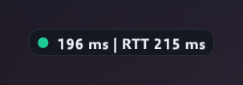
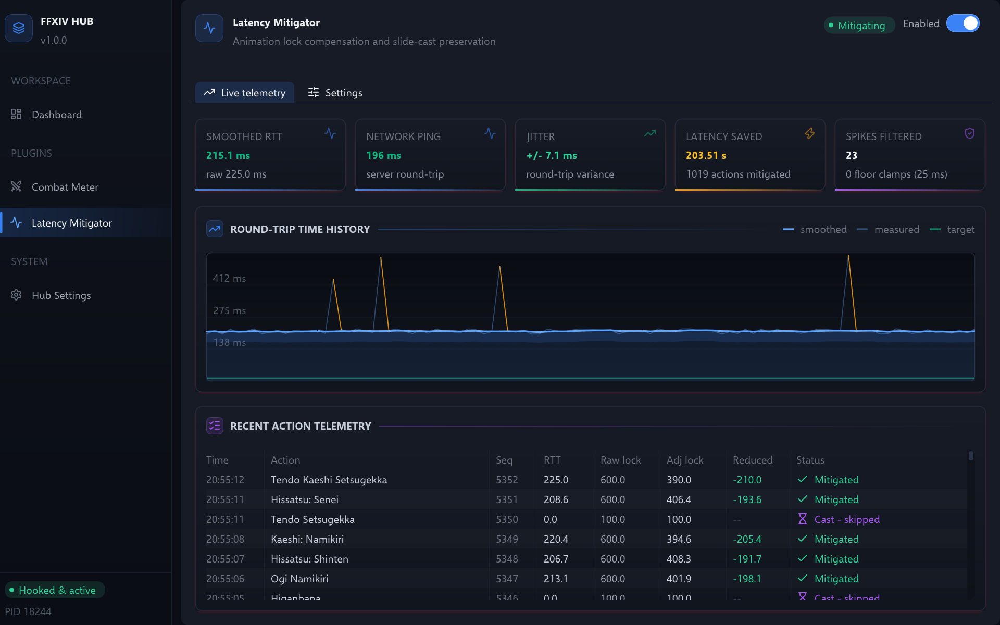

# ⚡ Latency Mitigator

Stops animation lock from clipping your weaves, so off-GCD abilities double-weave cleanly
on medium to high latency connections (50 ms – 300+ ms). It never reduces the lock to
zero, and never allows action rates the server would reject.

Part of [FFXIV Hub](../../README.md). Enable or disable it from its page in the desktop
app, or from its card on the dashboard.

## At a glance

- **Adapts on its own.** It measures your real action round trip, and takes everything
  above a 15 ms target off the lock the server sends. There is no ping to enter.
- **Hard limits.** It never goes below a 25 ms floor, and leaves the 100 ms caster tax,
  rejected actions and locks over 2.5 s untouched.
- **Spike-proof.** Round-trip samples are smoothed, and outliers are rejected, so one
  slow packet doesn't swing the adjustment.
- **Visible.** An in-game badge shows your ping and round trip, and the desktop view
  graphs every sample and lists every action it touched.
- **Reversible.** Dry-run mode measures and reports but writes nothing.

---

## How it works

### Two different latencies

The plugin measures two things that are easy to confuse:

- **Network ping** is wire latency. A background ICMP prober measures it against the
  game server IP, which it discovers from the client's own active TCP connections. It
  updates continuously, in or out of combat.
- **Action RTT** is the true combat round trip: the time from your client dispatching an
  action (`UseActionLocation`) until the server's effect packet comes back
  (`ReceiveActionEffect`). This is the number that governs animation lock.

Action RTT is always higher than ping, because the server evaluates combat logic and
cooldowns between the two events. That gap is server frame processing, not network
distance, and it is the part that makes weaving feel late.

### What gets adjusted

When the server's effect packet arrives, it carries an animation lock value. The plugin
subtracts the measured round trip from that lock. It does not invent a new one. The lock
you experience then approximates what a player sitting next to the datacenter would feel.

**Smoothing and spike filtering.**

- Each action is trimmed by its own measured round trip, so a lock is never cut by more
  than that action actually waited.
- Once five samples are in, a spike filter rejects a sample that lands above
  `median + max(50 ms, 0.5 × median, spike_multiplier × jitter)`. The median is taken
  over the sample window. That action is trimmed by the median instead, so one slow packet
  does not swing the adjustment.
- The rejected sample is also kept out of the exponential moving average (EMA). The EMA is
  the smoothed RTT that the HUD and the graph show.
- The rejected sample still enters the window itself. So one spike never moves the
  median, but a real, sustained rise in latency is picked up within about half a window
  instead of being rejected forever.
- Fast samples are never filtered. TCP acknowledgement coalescing delivers bursts of
  them, and resetting on those would make mitigation cut in and out.

**Matching responses to actions.** Matching a returning packet to the action that caused
it uses two strategies:

- The exact sequence counter match is the normal path for every action, queued ones
  included. The game increments the counter as it sends, and the plugin records it right
  after.
- A response whose sequence finds no pending request falls back to the oldest pending
  request with the same action id.

**Queued actions.** A queued action is recorded when the game actually sends it, once
the current lock ends, not when you pressed the key. Its round trip therefore holds no
waiting time and is measured like any other.

### What is deliberately left alone

- **Caster tax.** The 100 ms lock after a cast completes is never mitigated. Trimming it
  would clip slide-casting and desynchronise caster rotations from the server. Two guards
  hold it:
  - the cast flag recorded with the action
  - a cast timer, started from the cast's remaining time whenever an action goes out
    mid-cast, and stopped when an action goes out with no cast in progress. A cancelled
    cast sends nothing back, so without that it would hold mitigation off for the rest of
    its cast time.
- **The floor.** Adjusted lock never drops below 25 ms, whatever the measured latency. A
  lock that already sits at or under the floor is left as it is.
- **Very long locks.** Locks above 2500 ms pass through untouched. They are either
  malformed or legitimately long (a Limit Break), and shortening either is unsafe.
- **Rejected actions.** If the server refuses an action, nothing is written.

The plugin never writes a speculative lock at dispatch time. Guessing before the server
answers, and guessing wrong, leaves the character frozen.

---

## In-game HUD

A small badge rendered directly into the game's backbuffer, showing network ping and
Action RTT.

- Drag it to reposition it when unlocked, and lock it to hold its position.
- Enable click-through so clicks pass to the game.
- It sizes itself to its content.

**Display modes** (`overlay_mode`):

| Mode | Value | Shows |
|---|---|---|
| Compact Inline | `0` | Both metrics on one line |
| Two-Row Stacked | `1` | Ping and RTT on separate rows |
| Ping Only | `2` | Wire ping alone |

**Ping grading.** The badge is colour-graded against shared thresholds
(`PING_GRADE_GOOD_MS` / `FAIR_MS` / `POOR_MS` in
[`types.hpp`](include/mitigator/types.hpp)). The desktop view uses the same bands, so the
two never disagree:

| Band | Threshold | Meaning |
|---|---|---|
| Good | < 180 ms | Optimal |
| Fair | ≤ 260 ms | Reasonable cross-region latency |
| Poor | ≤ 340 ms | High latency |
| Bad | > 340 ms | Critical / route degradation |

**Reading the badge.**

- A dimmed reading means no measurement yet: idle out of combat, or waiting on the first
  server response.
- The badge turns amber with a `!` for 1.5 s after the spike filter rejects a sample.

**Hover tooltip.** Hovering the badge shows:

- network ping
- action RTT
- what mitigation is doing: mitigating, dry-run, switched off, or just filtered a spike
- whether click-through is on

A click-through badge takes no mouse input, so it shows no tooltip.

---

## Desktop view

The page header shows what the plugin is doing right now:

- *Mitigating*
- *Dry-run - measuring only*
- *Mitigation disabled*

Below it are two tabs.

**Live telemetry**

- **Stat tiles:**

  | Tile | What it shows |
  |---|---|
  | Smoothed RTT | The latest smoothed round trip, with the raw sample below it |
  | Network ping | The ICMP ping to the game server |
  | Jitter | The round-trip variance |
  | Latency saved | Total lock removed, with the count of actions mitigated. Dry-run and switched-off actions add nothing. |
  | Spikes filtered | Samples the filter rejected, with the count of mitigated locks clamped to the floor |

  The round-trip tiles use the same colour bands as the HUD.
- **Round-trip time history.** A graph of the smoothed curve over the measured samples,
  with the target ping as a reference line. Samples the filter rejected are drawn in
  amber. Hover it for any sample's smoothed and measured RTT, jitter and delay removed.
- **Recent action telemetry.** Every ability the client sends, newest first, with the
  columns Time, Action, Seq, RTT, Raw lock, Adj lock, Reduced and Status. The raw and
  adjusted locks sit side by side, so you can see exactly what was changed. The status
  is one of:

  | Status | Meaning |
  |---|---|
  | Mitigated | The lock was shortened. |
  | Clamped to floor | The lock was shortened, but stopped at the floor. |
  | Spike filtered | This action's RTT sample was a spike, so the median took its place, both in this action's trim and in the EMA. |
  | Cold start guard | There are fewer than five samples so far, so the sample was capped. |
  | Cast - skipped | A cast lock, left alone to protect slide-casting. |
  | Dry-run (not applied) | Calculated, but not written. |
  | No change | Nothing was trimmed, for one of these reasons: the round trip was already under the target; the lock was at or under the floor, or over the ceiling; the response matched no recorded action; or *Enable animation lock mitigation* is off. |

**Settings**

| Section | Controls |
|---|---|
| Mitigation algorithm | *Enable animation lock mitigation*, *Target ping* (10–40 ms), *Safety floor* (25–100 ms), *Spike multiplier* (2.0–4.0×), *Dry-run mode* |
| In-game overlay | The shared overlay controls: visibility, lock, click-through, opacity, scale, hide conditions, and *Hide after combat* for a HUD shown only in combat |
| HUD display | *HUD layout* |
| Maintenance | *Reset HUD position*, *Reset statistics* |

---

## Configuration

Stored in the `latency_mitigator` section of `%APPDATA%/ffxiv-hub/config.json`. Everything
here is editable from the plugin's page in the desktop app; the file is the persistence
format, not the intended interface.

| Key | Type | Default | Description |
|---|---|---|---|
| `plugin_enabled` | bool | `true` | Master switch. Off means no hook dispatch, no telemetry, no overlay. |
| `enabled` | bool | `true` | Stops the animation-lock write-back only. Narrower than `plugin_enabled`: the plugin still measures and reports. |
| `dry_run` | bool | `false` | Calculate and stream telemetry without modifying game memory. |
| `target_ping_ms` | float | `15.0` | Simulated LAN latency near the datacenter. |
| `min_animation_lock_ms` | float | `25.0` | Hard floor. Adjusted lock never goes below this. |
| `max_animation_lock_ms` | float | `2500.0` | Locks above this pass through unmitigated. Never below `min_animation_lock_ms`. |
| `rtt_sample_window` | int | `10` | Samples the median and spike filter look back over, `1`–`64`. |
| `safety_margin_ms` | float | `0.0` | Extra lock kept on top of the target ping. Never negative. |
| `spike_multiplier` | float | `2.5` | Jitter multiple in the spike tolerance, `median + max(50 ms, 0.5 × median, this × jitter)`. At least `1.0`. |
| `overlay_visible` | bool | `true` | Draw the in-game HUD. |
| `overlay_mode` | int | `0` | Display layout. See the table above. |
| `overlay_x`, `overlay_y` | float | `20.0` | HUD position. |
| `overlay_width`, `overlay_height` | float | `120.0`, `32.0` | HUD size. |
| `overlay_opacity` | float | `0.90` | Background transparency. |
| `overlay_scale` | float | `1.0` | Font and badge scaling. |
| `overlay_locked` | bool | `false` | Prevent dragging the HUD. |
| `overlay_click_through` | bool | `false` | Pass mouse clicks through to the game. |
| `overlay_hide_conditions` | int | `0` | Bitmask of game states that hide the HUD. Zero is always visible. |
| `overlay_hide_after_combat_seconds` | float | `5.0` | Seconds the HUD stays up once combat ends, when it is shown only in combat. |

---

## FAQ

<b>Why does the HUD show a higher RTT than my ping test?</b>

 

They measure different things. Network ping is packet travel time. Action RTT includes
the server evaluating combat logic and cooldowns before it answers, which adds tens of
milliseconds on top of raw ping. The mitigator works from Action RTT, because that is
what actually delays your next weave.

<b>I have 200 ms latency. Should I raise the target ping?</b>

 

No. The 15 ms default represents the ideal latency of a player near the datacenter, and
it is the target the engine subtracts *toward*. Leaving it alone is what grants full
double-weaving regardless of physical distance. Raising it mitigates less, not more.

<b>How do I see what it would do without letting it change anything?</b>

 

Turn on *Dry-run mode*. Every action is still measured, calculated and listed in the
action feed as *Dry-run (not applied)*, but nothing is written to game memory.

<b>Is this safe?</b>

 

It stays within what the server already permits:

- It enforces a hard 25 ms floor and never reduces the lock to zero.
- It preserves cast locks, so slide-casting is unaffected.
- It ignores actions the server rejected.
- It does not manipulate packets, or produce action frequencies the server would not
  otherwise allow.

See [Safety and fair play](../../README.md#-safety-and-fair-play) for the whole picture,
including the one rule to follow in game.

---

Engineering constraints for this plugin are in [`AGENTS.md`](AGENTS.md).
